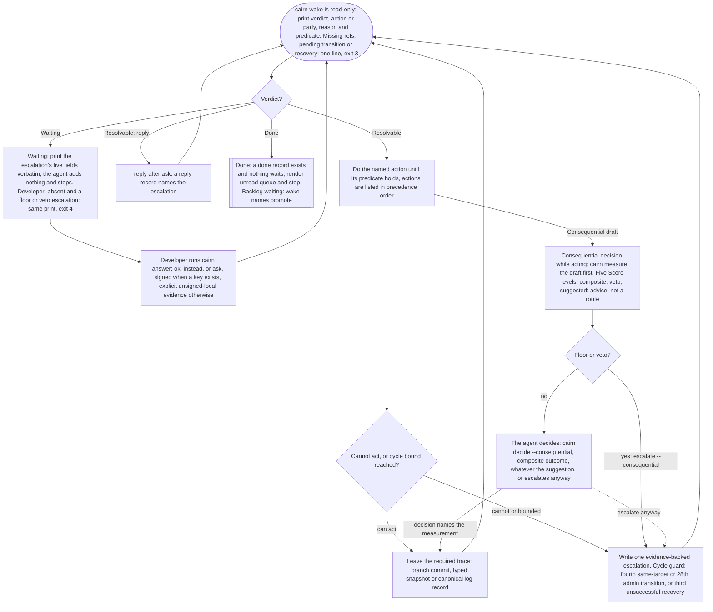

# Cairn

**A way to keep AI-assisted development tied to what you actually agreed to build.**

You decide what the software should do. Your coding agent implements it.
Cairn reads the project's Git records, checks whether the evidence is still
current, and names what needs attention next.

The aim is simple: a new agent session should be able to find the agreement,
the work already done, the checks that passed or failed, and the decisions
still waiting for you. Those facts live in your Git repository, in commits
you can inspect with plain Git, rather than only in a conversation that the
next agent may never see.

[Read the human manual](docs/manual.md) | [Try the worked example](docs/walkthrough.md)

## What Cairn does

Cairn has two parts:

- **Project skills** help your agent learn an existing codebase, plan a new
  project with you, or open the next feature of a project already under
  Cairn. They produce written requirements, ways to check them, and one
  selected piece of work.
- **A command-line tool** reads and writes those records, runs the declared
  checks when asked, and reports the next action.

Cairn does not run the agent for you, and it calls no AI model on its own
unless you turn on the TypeSafe evaluator in settings. At one
narrow kind of decision -- a Consequential choice -- the agent takes one
measurement of its own draft before deciding: five scored dimensions and a
composite, computed in code from the model's answers, never a verdict by
itself. Only a fixed code floor and the measurement's own veto ever force
that decision to you instead of the agent; every other case is the agent's
judgment, informed by the reading. On the in-tree benchmark (24 drafts over
one small project, `tests/bench`) the measurement's suggestion matches the
expected route 22 times in 24; the ceiling and weights were chosen on those
same 24 drafts, so treat the figure as in-sample, not a guarantee. You use
your usual coding agent, and the
agent follows the project's working agreement. The tool runs on Node and
Git, with no build step, runtime packages, database, or service.

For example, you might agree that a form must reject an empty name. The
agent writes a check that actually submits an empty name. Cairn records
whether that check passed and whether its result still applies after the
code changes. Before the work is called complete, an independent reviewer,
started with none of the builder's context, also attacks what the check
might have missed.

## How the work moves forward

A **commitment** is one agreed piece of work, such as "reject empty names."
It is not a Git commit. One commitment can involve many Git commits, and at
most one commitment is open at a time.

You and the agent agree on a goal and what would count as success. The agent
then asks Cairn for the next action, does that work, and asks again. When a
decision belongs to you, the agent presents it and waits. When the
commitment is complete, the agent promotes the next idea from the backlog
and continues, or stops at Done. Ideas that would change the agreed
contract wait for the next feature specification, which you open.

### Who does what?

| You | Your coding agent | Cairn |
|---|---|---|
| Choose the goal and confirm the intended behavior. | Investigate, propose requirements, and explain trade-offs. | Read the agreed requirements and the open commitment. |
| Challenge unclear choices and weak checks. | Implement, commit, run checks, and examine the work. | Record check results and determine whether they are current. |
| Answer decisions that need your judgment. | Keep decisions and findings in the repository's records. | Print the next recorded action or the waiting question. |
| Review queued decisions; open the next feature when you choose. | Promote the next backlog idea, or stop at Done. | Report Done only when nothing remains the agent may decide. |

### What the three verdicts mean

| Verdict | Plain meaning | Whose turn? |
|---|---|---|
| `Resolvable` | There is a named action, and the exact record or code that completes it. This is normal progress, not an error. | The agent. |
| `Waiting` | An escalation is unanswered. Cairn prints its five fields; the agent adds nothing. | You. |
| `Done` | Every requirement in the commitment has current passing evidence, an independent report found nothing left open, and the backlog holds nothing to promote. | You: open the next feature when you choose. |

Done does not mean the whole product is finished, deployed, or guaranteed
correct. It means the open commitment meets Cairn's recorded conditions.

### What Done requires

- Every requirement in the commitment's frozen set has a current passing
  check, bound to that requirement's exact text.
- A review and an independent report exist at the same point in the work,
  and every finding either has a fix or a developer ruling.
- The latest acceptance looked at everything that changed since the report,
  including every fix, and accepted each one.
- No question is unanswered, no undeclared change sits unresolved, no known
  defect is unfixed, and no decision that needed building is still unbuilt.

The backlog is not part of this rule. When it holds nothing to promote,
Cairn reports Done and stops. Ideas the agent captures during the work go
to one of two places. An idea already covered by the agreed specification
goes to the backlog. The agent may promote one into the next commitment on
its own, and it records that decision for your review. An idea that would change
an agreed requirement or the working agreement waits for the next feature
specification, which you open. Neither is a place to park unfinished
work: an in-scope problem the agent cannot solve becomes a question to you,
not a note.

Here is the work loop each `cairn wake` cycle follows: one named action
with its completion predicate, done by the agent, then wake again.



The Graphviz source is docs/diagrams/work-loop.dot.

## Install

Cairn is a plugin. One install brings the command, the four skills, and the
hooks. Have Node 24 and Git 2.40 or newer available. Cairn runs on Linux
and macOS; Windows is not supported, since the hooks use symbolic links and
`$HOME`.

### Install the plugin

In Claude Code:

```
/plugin marketplace add eas4ai/cairn
/plugin install cairn@cairn
```

In Codex:

```sh
codex plugin marketplace add eas4ai/cairn
codex plugin add cairn@cairn
```

In Muse, install the checkout as a local bundle, where `<checkout>` is
the absolute path of the clone:

```sh
muse plugins install <checkout>
muse plugins approve cairn:hook:session-start
muse plugins approve cairn:hook:stop
muse plugins list
```

The skills work as soon as the plugin is installed; the two hooks run
once you approve them. `muse plugins validate <checkout>` checks the
bundle without installing it. After pulling the checkout, run
`muse plugins update cairn` to refresh the installed bundle.

That is the install. Claude Code and Codex register the three hooks from
the plugin's `hooks/hooks.json` (SessionStart, UserPromptSubmit, Stop);
Muse reads two hook entries, SessionStart and Stop, from the plugin's
`.muse-plugin/plugin.json`. Ask your agent to use the `install-cairn`
skill once: it links `$HOME/.local/bin/cairn` to the plugin's
`bin/cairn.mjs` when nothing is there yet. Inside a Cairn project, the
session-start hook prints the wake verdict; outside one, it names
`/new-project` or `/existing-project`. No hook creates the link, refuses a
stop, counts anything, or writes a record; a hook only prints, and a
harness without hooks relies on the working agreement in `AGENTS.md`.
Make sure `$HOME/.local/bin` is on your `PATH`:

```sh
export PATH="$HOME/.local/bin:$PATH"
cairn --help
```

`cairn --help` lists every command; it works outside a project and
changes nothing. Every key in `.cairn/settings.json`, and how to turn on
the TypeSafe evaluator with a key from typesafe.ai, is in the manual's
[Settings](docs/manual.md#settings) section. Updates come through the marketplace (in Claude Code,
`claude plugin update cairn@cairn`), or in Muse with
`muse plugins update cairn`.

Then open your project and continue at
[Start with your project](#start-with-your-project).

### Other agents: the skills CLI

An agent without a plugin marketplace gets the skills through the
[Vercel skills CLI](https://github.com/vercel-labs/skills), using npm/npx:

```sh
npx skills add eas4ai/cairn --skill install-cairn new-project existing-project next-feature --agent codex --global
```

Use `--agent claude-code` for Claude Code. For Muse, use
`--agent universal` without `--global`: it installs into the project's
`.agents/skills/`, which Muse reads in a trusted workspace (with
`--global` it installs into `$HOME/.config/agents/skills`, which Muse
does not read). Omit
`--global` to install only in the project where you run the command.
Preview the available skills with `npx skills add eas4ai/cairn --list`.
The skills carry instructions and templates, not the command. Tell your
agent:

> Use install-cairn to install the Cairn command and verify that it works.

The skill links the command and registers hooks where the harness
supports them, following the same steps as the next section.

### Install from a checkout

The by-hand path, for a harness without a marketplace or for working on
Cairn itself. Run this in the directory where you keep the checkout:

```sh
git clone https://github.com/eas4ai/cairn.git
```

Then, once per machine, link the command:

```sh
mkdir -p "$HOME/.local/bin"
[ -e "$HOME/.local/bin/cairn" ] || ln -s "$(pwd)/cairn/bin/cairn.mjs" "$HOME/.local/bin/cairn"
```

This never replaces an existing file at that path. Put `$HOME/.local/bin`
on your `PATH` as above and check `cairn --help`. Then register the hooks
under `hooks/` with your agent's own hook configuration, once, using the
event names in `hooks/hooks.json`. They are optional: the working
agreement in `AGENTS.md` is the path an agent takes without them. Skills
come with the plugin, go into your agent's skill directory through the
skills CLI, or are linked from `skills/` by you.

The link points into the plugin or checkout it was made from, so keep
that in place.

## Start with your project

Open your project's repository in your coding agent. The four skills are
opened by you, by name, the way your agent application invokes a skill: in
Claude Code, type the name with a slash. They do not appear in the agent's
own skill list, so a prose request does not reach them.

For new software:

> /new-project I want to build [describe the software]. Help me agree on
> the first useful piece of work and how we will check it.

For a codebase that already exists:

> /existing-project Read the code before making claims about it. Explain
> what you found, then help me prepare [describe the change].

For a project already under Cairn, once the loop reports Done:

> /next-feature Specify [the waiting item or the feature] as the next
> commitment.

Each of these skills runs `cairn init` the first time it is needed: it
asks you to confirm one authority remote, or explicit local-only
operation, and to choose a signing key or accept unsigned-local evidence
as the record of your decisions. Nothing else in Cairn asks for that
setup.

The agent should explain requirements in terms you understand and propose
observable failures that would show they are not met. Cairn calls one of
these a **falsifier**. "An empty name is accepted" is a concrete example.
You confirm the behavior and its falsifier; the agent writes the files and
runs `cairn authorize` only after you do, since that command is yours to
run.

Once the agreement is recorded, ask the agent to continue under Cairn. It
starts with `cairn wake` from your project's repository root.

**If a question is unclear, ask for another explanation before you decide.**
You can say, "Explain what each option would change for me." A request for
explanation is not approval to implement an option.

## What you need to watch

You do not need to approve every implementation detail. Pay attention to:

- **The agreement.** Does it describe the behavior you want? Does the
  proposed check expose a real failure of that behavior?
- **Escalations.** Is the choice clear, and do you understand what your
  answer authorizes? `cairn answer <slug> ask '<question>'` keeps the
  decision open.
- **The decision queue.** Some consequential decisions are recorded for
  your review while the agent continues. These are different from
  escalations: work does not wait for you to read them.
- **The result.** Ask what changed, what was checked, what the review
  found, and what remains outside the agreement. Try the result yourself
  where that helps you judge it.

The [human manual](docs/manual.md) walks through each of these moments,
including exactly how `ok`, `instead`, and `ask` work.

## What Cairn can and cannot establish

Cairn can detect missing or stale evidence, malformed declarations,
undeclared changes, unfinished transactions, and open review findings. It
keeps the command output behind the results so you can inspect what
happened, and it records every fact as a Git commit you can read with
plain Git.

It cannot judge whether the agent wrote a useful check or performed a
thoughtful review. A command that always succeeds can produce passes
without proving anything. Ask the agent to show a safe failing example and
the corrected case, and explain why the check failed.

Freshness depends on the files a check declares as inputs. Cairn cannot
infer an omitted dependency or notice that an external service changed
while the repository stayed the same. Broad inputs catch more changes but
can make rechecking expensive. Narrow inputs need careful maintenance.

Cairn is a discipline tool, not a security boundary. It checks recorded
results and freshness; it cannot judge whether a review is thorough or a
check proves what it claims to. The developer must challenge unsound
checks, and the agent must demonstrate what makes them fail.

## Find your way around

| Read this | When you need it |
|---|---|
| [Human manual](docs/manual.md) | Everyday use, decisions, results, and troubleshooting. |
| [Worked example](docs/walkthrough.md) | A small project you can run from install through a finished commitment. |
| [Working agreement template](skills/new-project/templates/AGENTS.md) | The exact responsibilities a project's agreement gives the agent. |
| [Specification](docs/spec/cairn-v2.md) | Cairn's own requirements and terminology. |
| [Releasing Cairn](docs/releasing.md) | How this repository cuts and tags a release. |

Cairn's own development uses the same workflow. From this repository,
`node bin/cairn.mjs wake` reports its current action, and
`node bin/cairn.mjs lint docs/spec` checks the specification.
