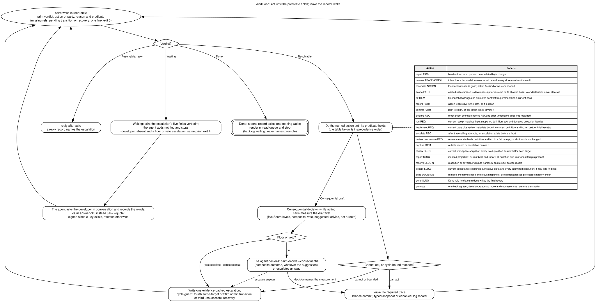

# Cairn

**A way to keep AI-assisted development tied to what you actually agreed to build.**

You decide what the software should do. Your coding agent implements it.
Cairn reads the project's records, checks whether the evidence is still
current, and names what needs attention next.

The aim is simple: a new agent session should be able to find the agreement,
the work already done, the checks that passed or failed, and the decisions
still waiting for you. Those facts live in your Git repository, rather than
only in a conversation that the next agent may never see.

[Read the human manual](docs/manual.md) | [Try the worked example](docs/walkthrough.md)

## What Cairn does

Cairn has two parts:

- **Project skills** help your agent learn an existing codebase or plan a new
  project with you. They produce written requirements, ways to check them,
  and one selected piece of work.
- **A command-line tool** reads those files, runs the declared checks when
  asked, records their results, and reports the next action.

Cairn does not call an AI model or run the agent for you. You use your usual
coding agent, and the agent follows the project's working agreement.
The tool runs on Node, uses Git, and needs no build step, runtime packages,
database, or service.

For example, you might agree that a form must reject an empty name. The
agent writes a check that actually submits an empty name. Cairn records
whether that check passed and whether its result still applies after the
code changes. Before the work is called complete, the agent also reviews
what the check might have missed.

## How the work moves forward

A **commitment** is one agreed piece of work, such as "reject empty names."
It is not a Git commit. One commitment can involve many Git commits.



You and the agent agree on a goal and what would count as success. The agent
then asks Cairn for the next action, does that work, and asks again. When a
decision belongs to you, the agent presents it and waits. When Cairn reports
Done, the agent stops; you choose whether and what to do next.

The diagram summarizes the workflow. It does not imply that Cairn launches,
pauses, or supervises your agent. [Mermaid source](docs/diagrams/work-loop.mmd).

### Who does what?

| You | Your coding agent | Cairn |
|---|---|---|
| Choose the goal and confirm the intended behavior. | Investigate, propose requirements, and explain trade-offs. | Read the agreed requirements and selected commitment. |
| Challenge unclear choices and weak checks. | Implement, commit, run checks, and examine the work. | Record check results and determine whether they are current. |
| Answer decisions that need your judgment. | Keep decisions and findings in the repository. | Point to the next recorded action or outstanding question. |
| Review the result and choose the next goal. | Stop when the commitment is complete. | Report Done when its recorded conditions are met. |

### What the three verdicts mean

| Verdict | Plain meaning | Whose turn? |
|---|---|---|
| `Resolvable` | There is a named action the agent can take. This is normal progress, not a general error. | The agent. |
| `Escalate` | A recorded question awaits your answer. | You. |
| `Done` | The required checks are current and passing, the review has no open findings, and no earlier action is blocking completion. | You choose what happens next. |

Done does not mean the whole product is finished, deployed, or guaranteed
correct. It means the selected commitment meets Cairn's recorded conditions.

## Install

Have Node, Git, and Bash available. Run these commands in the directory
where you want to keep the Cairn checkout:

```sh
git clone https://github.com/eas4ai/cairn.git
cairn/scripts/link.sh
```

The installer links the `cairn` command into `$HOME/.local/bin` and the
`new-project` and `existing-project` skills into `$HOME/.agents/skills`.
It leaves existing files in place and reports conflicting links.

Make sure `$HOME/.local/bin` is on your `PATH`. If it is not, add this to
your shell's startup file, then open a new terminal:

```sh
export PATH="$HOME/.local/bin:$PATH"
```

Check that the command can be found:

```sh
command -v cairn
cairn --help
```

`cairn --help` (or `cairn -h`) lists commands, options, and examples.
It works outside a project and does not run any checks or change records.

If your agent reads skills from another directory, use the installer's
`--skills DIR` option. It can be repeated for more than one directory.
`--bin DIR` changes the command location. See the
[installation details](docs/manual.md#installation-details) for conflicts,
updates, and removal.

The links point into this checkout, so keep it in place. There is no
`cairn init` command: the project skills help the agent prepare your project.

## Start with your project

Open your project's repository in your coding agent. The exact way to select
a skill depends on the agent application; the skill names are `new-project`
and `existing-project`.

For new software, you can say:

> Use the new-project skill. I want to build [describe the software]. Help
> me agree on the first useful piece of work and how we will check it.

For a codebase that already exists:

> Use the existing-project skill. Read the code before making claims about
> it. Explain what you found, then help me prepare [describe the change].

The agent should explain requirements in terms you understand and propose
observable failures that would show they are not met. Cairn calls one of
these a **falsifier**. "An empty name is accepted" is a concrete example.
You confirm the behavior and its falsifier; the agent writes the files.

Once the agreement is recorded, ask the agent to continue under Cairn.
It starts with `cairn wake` from your project's repository root.

**If a question is unclear, ask for another explanation before you decide.**
You can say, "Explain what each option would change for me." A request for
explanation is not approval to implement an option.

## What you need to watch

You do not need to approve every implementation detail. Pay attention to:

- **The agreement.** Does it describe the behavior you want? Does the
  proposed check expose a real failure of that behavior?
- **Escalations.** Is the choice clear, and do you understand what your
  answer authorizes? `ask <question>` keeps the decision open.
- **The review queue.** Some consequential decisions are recorded for your
  review while the agent continues. These are different from escalations.
- **The result.** Ask what changed, what was checked, what the review found,
  and what remains outside the agreement. Try the result yourself where
  that helps you judge it.

The [human manual](docs/manual.md) walks through each of these moments,
including exactly how `ok`, `instead`, and `ask` work.

## What Cairn can and cannot establish

Cairn can detect missing or stale evidence, malformed declarations, certain
scope breaches, unfinished records, and open review findings. It keeps the
command output behind the results so you can inspect what happened.

It cannot judge whether the agent wrote a useful check or performed a
thoughtful review. A command that always succeeds can produce passes
without proving anything. Ask the agent to show a safe failing example and
the corrected case, and explain why the check failed.

Freshness depends on the files a check declares as inputs. Cairn cannot infer
an omitted dependency or notice that an external service changed while the
repository stayed the same. Broad inputs catch more changes but can make
rechecking expensive. Narrow inputs need careful maintenance.

Cairn is a discipline tool, not a security boundary. Its command-line checks
and the agent's working agreement play different roles; the tool does not
prevent an agent from ignoring the agreement.

## Upgrading an existing Cairn project

This documentation describes the source in this checkout. If your command
points at a different checkout, its behavior may differ. Before adopting
these rules, read the [upgrade guide](docs/manual.md#upgrading-an-existing-cairn-project).

In particular, global requirements now need `Scope: every commitment` in
their spec file's header. A `PKG` prefix alone no longer makes them global.
Evidence and output files belong in Git, and `ask` now keeps an escalation
open for a reply.

## Find your way around

| Read this | When you need it |
|---|---|
| [Human manual](docs/manual.md) | Everyday use, decisions, results, and troubleshooting. |
| [Worked example](docs/walkthrough.md) | A small project you can run from a failing check through completion. |
| [Working agreement](AGENTS.md) | The exact responsibilities the agent is instructed to follow. |
| [Specification](docs/spec/overview.md) | Cairn's own requirements and terminology. |
| [Source map in the manual](docs/manual.md#where-these-explanations-come-from) | The implementation and tests behind the explanations. |

Cairn's own development uses the same workflow. From this repository,
`node bin/cairn.mjs wake` reports its current action. Contributors can run
`npm test`, `node scripts/spec-lint.mjs`, and `node scripts/pkg-lint.mjs`;
recorded evidence is produced by `node bin/cairn.mjs check` after committing.
