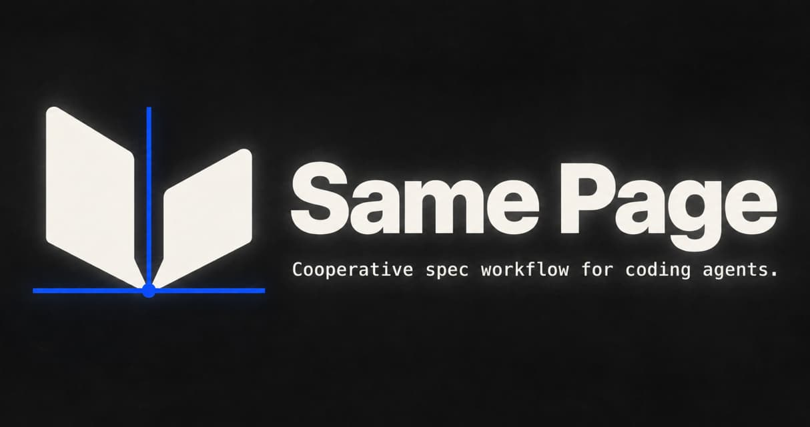

# Same Page -- The Manual

This manual explains how Same Page works and why each part is shaped
the way it is. It is explanatory text. The rules themselves live in
three normative specs under docs/superpowers/specs/: the package
design, the language (rules named LANG-nnn), and the language check
and evidence map (rules named CONF-nnn). Where this manual cites a
rule by identifier, the spec is the authority and the manual is the
explanation. The test suite fails if the manual cites an identifier
the specs no longer define.

One worked example runs through every chapter: a plugin broker. Plugins
send requests to the broker; the broker validates each request,
authorizes the operation, dispatches it, and caches plugin manifests
under short leases. The specs and the test fixtures use the same
example, so what you read here matches what the tooling checks.

Chapters:

1. The problem
2. The spec set
3. Vocabulary: the glossary and the standard dictionary
4. Writing requirements: Same Page Technical English
5. Agreement: the confirm-back loop and the falsifier
6. The evidence map
7. The gates: the language check and the drift gate
8. The three skills, walked through on the broker
9. Iterations
10. Same Page Conformance: the engine that comes next

## 1. The problem

Models contain more information than the people they assist. People
carry experience that no training run contains. Neither substitutes
for the other. A developer regularly presents a solution the model had
not considered, because the developer has lived the problem. A model
regularly names a concept the developer had not met, because the model
has read about it.

This difference leaks into language from both sides. A term the model
draws from its breadth lands as ambiguous to a reader on different
footing. A term the developer uses, such as "UX specification", can
mean something narrower than the model's default reading, and the
model drifts confidently in the wrong direction. Documentation written
from the model's priors gets called slop, often not because it is
wrong, but because writer and reader were never on the same page.

Same Page calls any divergence between an artifact and reality
"drift": in code, in specs, or in vocabulary. Drift starts in
vocabulary, which is why vocabulary comes first in every workflow
below.

The fix is not a better template. It is a cooperative workflow that
levels understanding in both directions before anything is specified,
then records the agreement in artifacts every future session
inherits. Four habits carry the whole method:

- Agree on words before using them to specify anything.
- Write each requirement so it says exactly one checkable thing.
- Confirm each agreed requirement by naming the state that would
  violate it.
- Audit each session against the agreed scope before it ends.

The written artifacts also protect both parties from a bad day. Human
communication quality fluctuates under pressure, and a model reading a
volatile message cannot separate the instruction from the weather
around it. Confirmed specs are a stable third thing both sides anchor
to. The developer is protected from a hard moment becoming a silent
contract. The model is protected from mistaking weather for direction.

A second driver is scope creep. Same Page addresses it in two ways: a
complete specification from the beginning, and a pressure valve that
turns mid-development ideas into specs for the next iteration instead
of ad-hoc growth of the current build.

## 2. The spec set

A project's specs live in one directory, docs/specs/<project>/, as
plain markdown. Both scripts recognize a spec set by the presence of
00-overview.md there. A project that keeps its specs elsewhere sets
SAME_PAGE_SPECS_DIR in the hook environment, and records the choice in
its working agreement.

| File | What it owns |
|---|---|
| glossary.md | The vocabulary: the standard dictionary, then the project's own terms, relationships, and flagged ambiguities. |
| 00-overview.md | The keystone: purpose, design principles, architecture with the why next to each choice, cross-cutting requirements, the spec map, supported and excluded scope, revision policy, completion criteria, its own decisions log. |
| ux.md | How the user interacts with the software: interaction model, journeys, surface map, decision points, error and recovery flows. It owns the map; domain specs own the streets. |
| NN-<domain>.md | One numbered spec per bounded subsystem. Features live inside their domain, each with acceptance criteria. |
| conventions.md | Implementation standards, naming, layout, and the exact verification commands. |
| iterations/NNN.md | The scope contract for one iteration: In, Out, definition of done. |
| iterations/next/ | Staged specs for the next iteration, written by /next-iteration. |
| conformance.md | The evidence map: each agreed requirement and what the code proves about it. |
| recon.md | Written by /existing-project only: the cited recon report and the Gaps list. |
| defects/<slug>.md | Written by /existing-project for a remediation: reproduction, expected behavior, root cause, regression test. |

Why numbered domains behind a keystone: each spec is one coherent
read for an agent. The overview holds the map, so discovery has one
starting point. Features live inside the domain that owns them, so
cross-cutting behavior has a home and a feature never sprawls across
files. Three health rules travel with the shape. A domain spec that
outgrows a single coherent read is a signal to split the domain. A
feature that spans domains is specified in its primary domain and
cross-referenced from the other, with ux.md holding the map. A small
project is the overview plus one or two numbered specs: fewer
numbers, same shape.

There is no central decisions file. Every spec carries a "Decisions
and revisions" section, newest first, and rationale sits next to what
it justifies.

Every spec opens with a status header. The lines the tooling reads:

    Status: Normative design specification
    Prefix: BROKER
    Last revised: 2026-09-01

The Prefix line declares the requirement-identifier prefix for that
spec, and only domain specs carry one. Other Status values are
"Draft", "Observed (as-built; unconfirmed)", "Agreed" with an
"Agreed: date" line, and "Scope contract" for an iteration.

Observed and Agreed are the two authorities a spec can have. Observed
text was drafted from reading the code: it says what the system does,
with a path cited, and nobody has yet agreed that this is also what
the system is meant to do. Agreed text carries the developer's
confirmation of both. Only Agreed sections may enter an iteration
contract's In list, and the drift gate asks at the end of each session
whether Observed text was relied on as contract. A file may stay
Observed while individual sections carry "Agreed: date" as their first
line; the file becomes Agreed when every section has.

The broker's spec set at the end of /new-project:

    docs/specs/broker/
      glossary.md
      00-overview.md
      ux.md
      01-broker.md            Prefix: BROKER
      conventions.md
      conformance.md
      iterations/001.md

## 3. Vocabulary: the glossary and the standard dictionary

The glossary is where leveling happens. An entry is a bold term, a
tight definition of what the term is, and an Avoid line that names the
rejected synonyms:

    **Lease**:
    The interval during which the broker treats a cached manifest as
    current. A lease has a start and a duration; expiry is observable.
    _Avoid_: TTL (an implementation detail), cache window

An unqualified Avoid term is banned outright in normative text, and the
language check reports it (LANG-013, CONF-006). An Avoid term with a
parenthetical qualifier, such as "out of scope (as a model verdict)",
is banned only under that condition. The condition is a judgment, so
the model applies it in pass two rather than the script in pass one.

The glossary has four sections. Working vocabulary is the standard
dictionary. Project terms are the project's own. Relationships records
how terms compose. Flagged ambiguities is an append-only log of term
collisions and how each was resolved.

### The standard dictionary

The Working vocabulary section ships with the package. It is
pre-seeded with the terms where model priors and developer intent most
reliably split: done, complete, defer, MVP, refactor, spec, iteration,
drift, Observed, Agreed, requirement, state, status, capability,
dependency, interface, defect, verify, reject, falsifier, evidence map,
coverage, and method.
"Done" means implemented and verified, not "code written". "Defer" is a
developer verdict, never a model verdict. "MVP" is not used: the spec
is the scope.

The section is identical in every project by default, and that is
enforced. The language check compares each entry with the copy shipped
in the glossary template beside the script and reports an entry that
differs, an entry that is missing, and a foreign entry in the section
(CONF-014). The glossary template's intro says the same: the section is
never edited in place.

The developer still owns their project. At Stage 1 the model presents
the standard dictionary as a whole and asks which terms the developer
would rule differently. A ruling is one more line inside the entry,
date then reason:

    **Status**:
    A reported summary of state for a reader. A status is derived; a
    state is stored.
    _Avoid_: state (when status is meant)
    _Ruling_: 2026-09-01 -- the broker exposes a /status endpoint; in
    this project "status" also names that endpoint's payload

An entry with a ruling passes the check, and the check lists the ruling
as information so the deviation stays visible. An entry that differs
without a ruling is drift. That is the whole distinction: an agreed,
recorded deviation is an agreement; an unrecorded one is drift.

The model has a matching duty. A standard term can be ambiguous in a
project: it collides with a domain term, or its definition does not
fit. Then the model says so before building on it, and the resolution
lands under Flagged ambiguities. A model that quietly picks a reading
is doing the thing the package exists to stop.

### Project and domain terms

The project's own terms land under Project terms, in the same entry
format, one at a time, each confirmed before it enters (LANG-012). The
technical vocabulary of the project's field is admitted freely on one
condition: it is defined. For those terms the most specific layer
wins, so a project's definition of "lease" governs its specs even if a
model's prior says otherwise (LANG-011).

In an existing codebase the code's name for a thing wins over the
synonym the model would have chosen. A collision between a code name
and a standard term, or between two code names for one thing, is
logged under Flagged ambiguities with the developer's resolution.

The broker's Project terms, after Stage 1:

    **Plugin**:
    A registered client of the broker, identified by a manifest.
    _Avoid_: extension, client (when a plugin is meant)

    **Manifest**:
    A plugin's declaration of identity and the operations it may use.
    _Avoid_: descriptor, config (when a manifest is meant)

    **Lease**:
    (as above)

## 4. Writing requirements: Same Page Technical English

Model prose optimizes for variety, flow, and register, which are
exactly the qualities that make a specification ambiguous. Same Page
Technical English (SPTE) is a controlled form of English for the
normative parts of a spec. It borrows the method of controlled
languages, writing rules plus a controlled dictionary, and builds its
own rules and dictionary from scratch. It claims no compliance with
any external standard and copies none of its text.

This sentence reads well and specifies nothing:

> The broker should gracefully handle invalid plugin requests while
> ensuring that unauthorized operations are appropriately rejected.

Three undefined qualifiers, one ambiguous keyword, two requirements
fused into one sentence. The same intent in SPTE:

    [BROKER-021]
    When a plugin sends an invalid request, the broker MUST reject the
    request.

    [BROKER-022]
    The broker MUST NOT execute an operation that the plugin is not
    authorized to use.

Now a reader knows exactly what has to happen, and a verification
layer has something to verify.

### Keywords

A normative statement uses exactly one of MUST, MUST NOT, or MAY
(LANG-001). MUST states behavior whose absence is a defect. MUST NOT
states behavior whose presence is a defect. MAY states behavior that is
permitted, and its absence is not a defect (LANG-002, LANG-003,
LANG-004). Keywords are written in upper case (LANG-006), and a
requirement is written in present tense: the obligation lives in the
keyword, never in "will" (LANG-008).

SHOULD is banned (LANG-005), and this is the largest single ambiguity
SPTE removes. A SHOULD is a requirement with unstated exceptions, and
the reader cannot tell whether a given deviation is one of them. In
Same Page the developer rules on exceptions, not the sentence. What
RFC-style writing marks SHOULD becomes either a MUST with its
exceptions written as conditions, or a note, because it was advice all
along (LANG-007).

### Sentences

- One requirement per sentence; compound requirements are split
  (LANG-020).
- The actor is named. "It", "this", "they", and "the system" are
  banned as subjects, so no reader has to resolve a referent
  (LANG-021).
- A condition comes first: "When X occurs, the broker MUST Y"
  (LANG-022).
- Active voice, unless the actor is genuinely unknown, which is rare
  enough to confirm with the developer (LANG-023).
- Thirty words is the limit; a longer sentence is split or confirmed
  as irreducible (LANG-024).

### Qualifiers

Vague qualifiers are banned in normative text: quickly,
appropriately, normally, gracefully, robustly, efficiently, seamlessly,
easily, simply, properly, adequately, reasonably, as needed, where
possible, if necessary, whenever possible, best-effort (LANG-030). A
banned qualifier becomes usable only by gaining a measurable glossary
definition. A quality requirement states a measurable bound and its
measurement condition, or it is rationale (LANG-031).

Before:

> The broker should refresh manifests reasonably often.

After:

    [BROKER-024]
    When a lease expires, the broker MUST fetch the plugin's manifest
    before dispatching the plugin's next request.

### Requirement and rationale

A requirement states behavior. Rationale explains it, in adjacent plain
text or in the spec's decisions log, never inside the requirement
(LANG-040). Examples and diagrams are non-normative unless a
requirement references them by identifier (LANG-041).

### Identifiers

Every requirement in a spec that declares a prefix carries an
identifier of the form [PREFIX-NNN], on its own line above the
requirement or opening its line (LANG-050). A spec declares exactly one
prefix in its status header, and the overview's spec map lists every
prefix (LANG-051). NNN is three digits, assigned in increasing order;
gaps carry no meaning (LANG-053).

Identifiers are permanent. A spec set never renumbers and never reuses
a retired identifier. A withdrawn requirement keeps its identifier with
the text replaced by "Withdrawn: date -- reason" (LANG-052). The
language check reads git history to catch a renumbered or reused
identifier, and says so when history is unavailable (CONF-002).
Permanence is what lets the evidence map, a defect record, and a
conversation months later all point at the same thing.

### Where SPTE applies

The check needs no judgment to find its scope. Normative text is what
sits under the canonical headings: Capabilities, Acceptance criteria,
Cross-cutting requirements, In, Out, Definition of done, and Expected
behavior, including their subsections (LANG-060). Any other section
becomes normative by placing the line "Normative." directly under its
heading (LANG-061). Overview narrative, ux journeys, glossary
definitions, decisions logs, and the recon report stay plain English.

Mention is not use. A term inside double quotes, a backtick code span,
or a fenced code block is a mention, and no keyword or terminology rule
applies to it (LANG-062). This is how a rule can name the words it bans
without violating itself, and how this manual can discuss SHOULD.

## 5. Agreement: the confirm-back loop and the falsifier

Every workflow in Same Page runs the same loop. The model surfaces its
interpretation of an ambiguous or loaded term and asks, in plain text,
one question at a time. Before writing any artifact, the model restates
its understanding in its own words; parroting the developer back hides
misunderstanding, and restating exposes it. A new term gets a glossary
entry the moment it emerges. No stage closes on unconfirmed
understanding. Depth is calibrated explicitly at Stage 0, never
assumed.

### The falsifier question

When the developer confirms a MUST or MUST NOT requirement, the model
asks:

> What observable state would violate this agreed requirement?

The model states the proposed falsifier in its own words and the
developer confirms it. The question is a comprehension test as much as
a record: a model that cannot name the violating state has not
understood the requirement it just wrote, and a wrong guess is the
point of asking. The confirmed falsifier is recorded with the
requirement it belongs to.

For the broker:

    [BROKER-021]
    When a plugin sends an invalid request, the broker MUST reject the
    request.
    Falsifier: a request with a malformed header reaches dispatch and
    the broker returns a success response.

    [BROKER-022]
    The broker MUST NOT execute an operation that the plugin is not
    authorized to use.
    Falsifier: a plugin whose manifest omits the write operation calls
    write, and the write executes.

A permission-only MAY requirement has no falsifier, because permitted
behavior is not itself obligatory. When a limit on permitted behavior
matters, the limit is written as its own MUST or MUST NOT requirement
with its own falsifier. "The broker MAY cache a manifest for the
duration of a lease" has none; "The broker MUST NOT serve a cached
manifest after its lease expires" has one.

The question runs at every agreement point: as each requirement is
confirmed in /new-project Stage 4, at the moment an Observed section
becomes Agreed in /existing-project, and at promotion in
/next-iteration's iteration close. An Observed requirement carries no
falsifier, because nobody has yet agreed what the code is meant to do.

### Re-anchoring

Direction that arrives mid-session and contradicts a confirmed spec is
not absorbed reactively. The model returns to the spec, and the change
is confirmed deliberately before anyone acts on it. Scope-affecting
directives that arrive in the heat of a moment are captured, in a
decisions log or through /next-iteration, and decided calmly. The
working agreement written at the end of every workflow carries this
rule for every future session.

## 6. The evidence map

Once every requirement carries a stable identifier, "does the
implementation honor the spec" stops being a feeling and becomes a map
from identifiers to evidence. That map is conformance.md, one table
per prefix, one row per Agreed identifier:

    ## BROKER

    | Requirement | Coverage | Method | Evidence |
    |---|---|---|---|
    | BROKER-021 | Covered | integration | tests/broker/invalid_request.rs::rejects_invalid |
    | BROKER-022 | Asserted | inspected | src/broker/dispatch.rs (authorization guard) |
    | BROKER-023 | Uncovered | - | |

Each column carries exactly one meaning, and that separation is the
design.

Coverage says whether the cited evidence addresses the requirement's
falsifier (CONF-041). Covered means that cited evidence beyond
implementation inspection addresses the falsifier. Asserted means that
implementation is cited and no evidence mechanism addresses the
falsifier. Uncovered means that no evidence is claimed.

Method names the mechanism that produced the evidence: formal, model,
property, integration, test, static, inspected, manual, or "-"
(CONF-045). The list is not a rank. A deterministic integration test
that executes the confirmed falsifier can establish more about one
requirement than a property search near it, and a formal result and an
integration result can establish different parts of one claim.

Evidence is a repository path that exists, with an optional
::identifier locator, and the check reports a citation to a path that
does not exist (CONF-042).

Four locks keep the columns honest. Inspection alone addresses no
falsifier, so a row whose method is inspected carries coverage
Asserted, and an Asserted row carries method inspected (CONF-046,
CONF-047). An Uncovered row carries method "-" and cites no evidence
(CONF-048, CONF-049).

The map records evidence about Agreed requirements only. An Observed
requirement never appears in it; evidence of as-built behavior stays
in recon.md citations until the section is Agreed (CONF-043). Every
Agreed identifier appears exactly once, and a withdrawn identifier
leaves the map in the same change that withdraws it (CONF-040).

The map is a claim register, not a contract. Writing Covered asserts
that the cited evidence addresses the falsifier, and a false Covered
entry is drift like any other. The map never changes a spec's Observed
or Agreed status (CONF-044). Three axes never mix: Covered, Asserted,
and Uncovered describe coverage; the method column describes the
mechanism; Observed and Agreed describe confirmation.

A row's life on the broker: /new-project Stage 6 scaffolds every
identifier Uncovered with method "-", the honest zero for a project
with no code. When the integration test for invalid requests lands,
BROKER-021 becomes Covered by integration. When the authorization guard
is written but only read, not exercised against its falsifier,
BROKER-022 is Asserted by inspection, and stays there until a test
executes the falsifier. Nothing in the map is ever inferred.

## 7. The gates: the language check and the drift gate

Same Page has two mechanical gates and a set of duties for the model.
Both scripts are dependency-free, run under Node or Bun unchanged, and
ship inside the new-project skill so every install channel carries
them.

### The language check

    node skills/new-project/scripts/language-check.mjs docs/specs/broker

The check runs in two passes. Pass one is the script: deterministic,
lexical, and structural, with zero false authority. It reports:

- requirement identifiers of the wrong form, duplicates, and
  undeclared prefixes (CONF-001);
- renumbered or reused identifiers, from git history (CONF-002);
- banned keywords in any letter case (CONF-003);
- lower-case keywords used normatively (CONF-004);
- banned qualifiers (CONF-005);
- unqualified Avoid terms (CONF-006);
- compound requirements (CONF-007);
- pronoun subjects (CONF-008);
- sentences over thirty words (CONF-009);
- standard-dictionary entries that differ from the shipped template
  without a ruling (CONF-014);
- every evidence-map inconsistency in chapter 6.

It finds normative text exactly as the language spec defines it
(CONF-012). It reports nothing from mentions (CONF-013).

The script never modifies a file (CONF-010). It writes its report to
stdout and exits zero on no findings and nonzero otherwise (CONF-011).
When a check cannot run, such as git history being unavailable or the
template not being beside the script, it says so on an INFO line rather
than passing silently.

A finding names the identifier, quotes the sentence, and lists each
issue with the rule it violates and a proposed resolution:

    AUTH-014

    "The service should gracefully handle invalid tokens."

    SERVICE
      Ambiguous term. (LANG-013)
      Project vocabulary contains: authentication service

    SHOULD
      Ambiguous normative strength. (LANG-005)
      Did you mean MUST or MAY?

    GRACEFULLY
      Undefined qualitative term. (LANG-030)
      State the observable required behavior.

Pass two is the model, in-session. It covers what a script cannot
judge honestly: a term used in two senses neither of which the glossary
rejects, distinct project terms conflated, an undefined qualitative
term not on the banned list, a referent that parses but misleads. The
model runs pass two over normative text it wrote or revised before
presenting it (CONF-020), and a pass-two finding cites the sentence,
the rule, and the glossary entries in tension (CONF-021).

Findings resolve through the confirm-back loop. The writer of the fix
states the proposed rewrite and its reading of intent, and applies
nothing before the developer confirms it (CONF-030). When a resolution
changes a term's meaning or retires a term, the glossary is revised in
the same change and the collision is logged (CONF-031). A checker that
silently rewrote specs would only have moved silent assumption-making
into a script.

### The drift gate

The drift gate is a completion hook. It fires on TaskCompleted and
Stop in Claude Code, registered by the plugin at install or offered by
the skills on first run, and on Stop in Codex through .codex/hooks.json.
When a session reaches completion in a project that has a spec set, the
gate blocks once, with exit code 2, and puts an audit prompt in front
of the model:

1. Does the session's work stay within the current iteration
   contract?
2. Was any out-of-contract work performed? If so, surface it and
   capture it, in a decisions log or under iterations/next/. Never
   silently ship it, never silently discard it.
3. Did the work make any touched spec untrue, and did new terms enter
   the conversation that belong in the glossary?
4. Was any spec section still marked Observed relied on as contract?
   If so, confirm it with the developer and mark it Agreed, or keep
   that work out of the contract.
5. The rule 13 self-evaluation from the nearest BEST_PRACTICES.md,
   with the rule's own text embedded when no ruleset is installed: do
   not deliver work you know to be deficient.
6. Did normative text written or revised this session pass the
   language check, and does the evidence map still tell the truth for
   the requirements this session touched?

The gate fires once per session, through a marker file under
SAME_PAGE_STATE_DIR or the system temp directory, so it cannot loop.
It fails open: no spec set, a malformed hook input, or any unexpected
error exits zero, because a gate that wedges sessions is worse than a
gate that misses one. The Codex adapter also exits silently when the
script has not been vendored at the documented path.

/next-iteration is the conversational counterpart of the gate. When
the model notices out-of-contract work mid-session, it opens the valve
itself rather than waiting for the audit.

### What the gates do not do

They do not prove code correct. Evidence is citation, and a cited test
can be wrong; deterministic guarantees remain the job of the tests
themselves, lint, and CI. They do not map changed files to requirements
automatically. They do not parse grammar; semantic judgment stays with
the model and the developer's ruling.

## 8. The three skills, walked through on the broker

All three skills share the standing rules of chapter 5, and all three
begin with the same baseline check.

### Onboarding, once per developer

Two baseline documents sit above every project. BEST_PRACTICES.md is
universal production discipline, the sibling package's 14-rule
ruleset; Same Page references it when installed and never authors a
competing copy. DEVELOPMENT_PRACTICES.md is the developer's own rules
of the road, portable across their projects: scope philosophy,
communication rules, verification gates, pacing.

At Stage 0 the skill reads DEVELOPMENT_PRACTICES.md. When it is absent
or still carries "status: default", the skill offers onboarding. It
harvests candidate rules from evidence that already exists, such as
working agreements and remembered corrections. It confirms each rule
in its own words, writes the personalized copy, and sets "status:
personalized". A developer who declines gets "status:
defaults-accepted". The shipped defaults function as-is, and no future
run asks again. The defaults are real rules, not placeholders: the
spec is the scope, no MVP-scoping, done means implemented and
verified, one item in progress at a time.

### /new-project

For software that does not exist yet. User-invoked.

Stage 0, baseline and orientation. The baseline check above. Then a
look at the directory: a codebase or a spec set already there means a
hand-off to /existing-project, because this workflow would document
intent nobody specified or overwrite agreed specs. Otherwise: what kind
of project, and what documentation depth. The broker is a service with
a small API surface; the developer and the model agree on the overview
plus one domain spec.

Stage 1, vocabulary. glossary.md is copied from the template. The
standard dictionary is presented for agreement, rulings are recorded,
and then the project's own terms are defined together, one at a time:
plugin, manifest, lease, dispatch, operation.

Stage 2, direction. The overview's first pass: purpose, design
principles, supported and excluded scope. The model states the purpose
in its own words first and writes only after the developer confirms.

Stage 3, interaction. ux.md. The broker has no screens, so its
interaction model is its API surface: the request sequence a plugin
follows from registration through dispatch, the error paths, and where
each action lives.

Stage 4, domains and features. Candidate features are enumerated and
partitioned into bounded domains, and the partition is confirmed before
anything is written. Then each numbered spec, one at a time, through
the confirm-back loop. Capabilities and acceptance criteria are
normative text: identified SPTE requirements, BROKER-021 onward. As
each requirement is confirmed the falsifier question runs, and the
language check runs before the stage closes.

Stage 5, technical shape. The overview is completed now that domains
exist: architecture with the why next to each choice, cross-cutting
requirements, the spec map listing every prefix, revision policy,
completion criteria. conventions.md is written with the exact
verification commands. Then reference leveling, on by default: the
authoritative upstream docs for the chosen stack are vendored into a
reference/ directory, so future sessions consult sources rather than
memory. The developer can decline for a project, and the decline is
logged.

Stage 6, the contract. iterations/001.md is negotiated: which specs or
sections are In, the explicit Out list, and the definition of done.
conformance.md is scaffolded with every identifier Uncovered and every
method "-". The language check runs once more over the whole set. Then
the working agreement block is written into the project's CLAUDE.md or
AGENTS.md. It is the few-hundred-token map every future session loads.
It names the spec set, the baselines, the contract, the verification
commands, the re-anchor rule, and the standing instruction that new
ideas go through /next-iteration.

### /existing-project

For a codebase that already exists. User-invoked. The code is the
source of truth about what the system does; the developer is the
source of truth about what it is meant to do; the model drafts from the
first and the developer corrects. Three rules join the standing set.
Every statement about the codebase carries a path; a claim without
evidence is a question rather than a finding. Observed is not Agreed.
Drift is a finding, never a quiet fix.

Two entry paths, decided at Stage 0. Path A: no spec set exists, so the
skill writes observed specs and the first contract. Path B: a spec set
exists, so the skill verifies it against the code, records the drift,
extends the specs where the work needs, and routes the work through
/next-iteration. On Path B the valve stays closed until recon and
verification are done, because a staged spec written before the model
has read the code is written from priors.

Suppose the broker has been in production for a year, has a spec set,
and a defect has arrived: cached manifests are served after their lease
expires.

Stage 0, baseline and recon. The baseline check. The spec set is read
before the code, so its vocabulary governs. Then the code, before
anything is asked: manifests and lockfiles, entry points, schema,
tests, CI, other documentation, and recent history, including every
commit since the specs were last revised, which is the window where
drift lives. recon.md is written with four cited buckets: exists,
documented, contradicted, unverified. Depth is calibrated by the work,
not the codebase: the developer names the defect, the model traces its
blast radius, the lease logic and its callers and tests, and only that
radius is verified to domain depth. Documenting everything first is
the failure mode the stage exists to prevent.

Stage 1, vocabulary from the code. The glossary exists and wins for
the project's own terms; the standard dictionary is present and agreed.
The model checks the glossary against the code and drafts only
renames, missing terms, and collisions. The code calls the lease
duration "ttl_secs"; the glossary says lease. That is a collision,
logged under Flagged ambiguities with the developer's resolution.

Stage 2, verification. Each spec section in the radius is reported as
one of four things. Holds: the code does what the section says, cited.
Drifted: the code no longer does what an Agreed section says, raised
with both sides cited; the developer rules whether the spec is revised
in place and logged, or the code is wrong and a defect record follows.
Still Observed: left unconfirmed by an earlier pass. Missing: written
as observed. Here the lease section is Agreed and says the broker MUST
NOT serve a cached manifest after its lease expires, and the code does.
The developer rules that the code is wrong. The observed text of what
the code does is kept as the record of what is; the intent stays in the
Agreed section; nothing is rewritten to match the bug.

Stage 3, the documentation gap. Undocumented behavior, contradicted
documentation, and untested behavior the work depends on are listed
under Gaps in recon.md with evidence. The expiry path has no test;
that is a gap inside the radius, and the developer chooses to close it
now. conventions.md is verified against the checks CI actually runs.

Stage 4, the work. A contract exists and the defect is not in its In
list, which is the usual case, so the work goes through
/next-iteration with the recon and verified specs as context. The
defect gets a first-class record at defects/lease-expiry.md:
reproduction, evidence, the Agreed section it violates, root cause, and
the regression test the fix ships with, failing before and passing
after. Then the working agreement block is updated, naming which specs
are still Observed and that Observed sections are not contract.

### /next-iteration

The scope-creep valve. Model-invocable by design: when the model
detects out-of-contract work, it opens the valve itself.

Capture. The skill reads the glossary, the overview, the current
contract, the domain specs the idea touches, and recon.md if one
exists. It restates the idea in its own words: what it is, which domain
owns it, what it touches, conflicts with, and depends on. The developer
corrects until confirmed. The spec is written under iterations/next/,
shaped to slot into its target domain spec at promotion, and the
language check runs on it at capture. Nothing is implemented.

Suppose the developer, mid-iteration, says the broker needs signed
manifests. That is a good idea and it is out of contract. It becomes
iterations/next/manifest-signing.md: what it is in SPTE, acceptance
criteria, what it touches (the manifest type, registration, the cache),
and one line on why not now.

Iteration close. When the developer says the current iteration is
done, the skill verifies the definition of done against reality, then
negotiates the next contract from iterations/next/. Each staged spec is
promoted, carried, or cut, and cutting is the developer's verdict.
Promotion is an agreement point. The falsifier question runs for each
promoted MUST or MUST NOT requirement. The promoted spec is merged into
its target domain spec with a revisions entry. Its identifiers enter
the evidence map Uncovered. Then iterations/002.md is written and the
working agreement's contract reference is updated.

## 9. Iterations

An iteration is the current scope contract, iterations/NNN.md. It has
three normative sections, all in SPTE.

In lists the domain specs or sections that ship, one line each with
what "shipped" means for it: "01-broker.md BROKER-021 through
BROKER-024 -> implemented and verified". Only Agreed sections may
appear here.

Out names what explicitly does not ship. Naming exclusions is what
makes the In list a contract. Ideas that arrive mid-iteration land in
iterations/next/, never here.

Definition of done is a checkable list: which acceptance criteria
pass, which verification commands are green, that the language check
reports zero findings for the spec set, and which evidence-map rows
cite evidence.

Work stays inside the contract. The drift gate audits every session
against it, and /next-iteration catches what arrives in between. When
the iteration closes, the negotiation described in chapter 8 produces
the next contract. The recon report's Gaps list is documentation debt
and is promoted or cut at the same moment, the same way.

## 10. Same Page Conformance: the engine that comes next

Same Page Conformance is the evidence engine the check and the map are
built for: obligations, confirmed falsifiers, typed evidence records,
assurance policy, verdicts, and trust anchors. Its feature spec is
complete and is kept under reference/ as source material. Its normative
specs are generated from that feature spec at stage 8 of the same
workflow this manual describes, with the developer ruling each of the
open "SHOULD" statements the feature spec carries on purpose. The engine
is then built as iteration contracts over its construction layers.

What ships today is the floor the engine stands on: a controlled
language, a deterministic check, and an evidence map that is a claim
register rather than a verdict. The CONF identifier prefix belongs to
the language check and evidence map spec and does not move with the
name, because identifiers are permanent.

Three things the check and the map are not. They are not an
auto-rewriter: the check surfaces, proposes, and waits. They are not a
proof system: a cited test can be wrong, and correctness remains the
job of tests, lint, and CI. They are not a file-to-feature verifier:
nothing maps changed files to requirements automatically.

## Appendix: where things live

| Path | What it is |
|---|---|
| skills/new-project/ | The creation workflow, every spec-set template, and both scripts. |
| skills/existing-project/ | The adoption workflow and its recon and defect templates. |
| skills/next-iteration/ | The valve and iteration close. |
| skills/new-project/scripts/language-check.mjs | The language check, pass one. |
| skills/new-project/scripts/spec-drift-gate.mjs | The drift gate. |
| docs/superpowers/specs/ | The normative specs and the package's own glossary. |
| docs/WORKFLOW.md | The process as plain instructions, for agents without a skill system. |
| docs/INSTALLATION.md | Install per agent, including Codex. |
| tests/ | The suites: the check, the gate, the Codex adapter, and this manual's identifiers. |

    bun test                                          # every suite
    node skills/new-project/scripts/language-check.mjs docs/superpowers/specs
                                                      # the package's own specs under their own check
