# Using Cairn: a human manual

You do not need to learn Cairn's file formats before you can use it. Your
job is to explain what you want, confirm that the written agreement means
what you think it means, and make the decisions that belong to you. The
agent can handle the files and commands.

This manual explains what to expect and what to say at each stage. Commands
are included for when you want to act directly. Examples using `APP-001` or
`storage-choice` are illustrative: substitute the identifier Cairn actually
prints. Run project commands from your project's repository root.

Run `cairn --help` or `cairn -h` for commands, options, examples, and exit
codes. You can also use `cairn check --help`. Help works outside a project
and does not run the named command or change any records.

Start with the [README](../README.md) for installation and an overview.
For a complete exercise you can run yourself, use the
[worked example](walkthrough.md).

## Contents

- [Start with a clear goal](#start-with-a-clear-goal)
- [Agree on behavior you can recognize](#agree-on-behavior-you-can-recognize)
- [Let the agent work, and know when it needs you](#let-the-agent-work-and-know-when-it-needs-you)
- [Answer a decision without guessing](#answer-a-decision-without-guessing)
- [Review decisions that did not stop the work](#review-decisions-that-did-not-stop-the-work)
- [Understand checks and their results](#understand-checks-and-their-results)
- [Decide what Done means for you](#decide-what-done-means-for-you)
- [Get unstuck](#get-unstuck)
- [Know where the records live](#know-where-the-records-live)
- [Installation details](#installation-details)
- [Upgrading an existing Cairn project](#upgrading-an-existing-cairn-project)
- [Where these explanations come from](#where-these-explanations-come-from)

## Start with a clear goal

Describe an outcome, not a list of implementation steps. For example:

> People keep losing unfinished drafts when they close the app. I want them
> to be able to reopen a draft and continue writing.

For a new project, ask the agent to use `new-project`. For existing software,
ask it to use `existing-project`. The existing-project skill instructs the
agent to inspect the code first and cite what it finds. A description of
what the code currently does is marked **Observed**. It becomes an agreement
about what the code should do only after you confirm it.

Expect the agent to propose the first **commitment**: one selected piece of
work with a defined result. A commitment is not a Git commit or a promise
about how long the work will take. It names what belongs in the current task.

You can ask:

> Explain what this commitment includes, what it leaves out, and what I will
> be able to do when it is finished.

The agent records ideas outside that task in the backlog. Capturing an idea
does not authorize it. You select the next commitment when you are ready.

## Agree on behavior you can recognize

A useful requirement describes an observable result. "Make draft saving
robust" leaves too much room for interpretation. "A saved draft can be
reopened with the same text" gives you something you can examine.

Cairn uses two terms you will see often:

| Term | Meaning | Example |
|---|---|---|
| Falsifier | An observation that would show the requirement is not met. | Reopening a saved draft loses part of its text. |
| Mechanism | The declared command that checks the requirement. | A test that saves a draft, reopens it, and compares the text. |

Before agreeing, ask whether the failure example would catch the mistake you
care about. A build succeeding does not, on its own, show that drafts survive
closing the app.

The agent should present related requirements and falsifiers together so
you can correct the wrong ones. You do not have to rewrite every item. You
do need to confirm the set; silence is not confirmation.

A requirement can carry its own status. For example, this block records a
hypothetical agreement made on the date shown:

```text
[APP-001] The app MUST reopen a saved draft with its text unchanged.
Falsifier: Reopening a saved draft loses or changes its text.
Status: Agreed 2026-09-05
```

`MUST` marks a requirement in the written specification. The status belongs
inside the same paragraph, before a blank line. It overrides the file's
status. A neighboring requirement can remain Draft or Observed while this
one is Agreed. The file header supplies a default only for blocks that have
no status of their own.

You can say:

> I agree with the save-and-reopen requirement. Leave automatic saving as
> Draft until we discuss when it should happen.

The agent can write the agreement for you. Confirming one requirement does
not confirm everything else in its file.

### When the software requires a host path

References to project files should use repository-relative paths, such as
`src/server.rs`. Some products also require a particular host binary or
configuration location. Those paths belong in the agreement too.

Ask the agent to declare them in the affected spec file's header, before
its first requirement:

```text
Host paths: /usr/bin/bwrap, ~/.suprnova/config.toml
```

The list applies only to that file. Each entry permits the exact path and
paths beneath it; `/run` covers `/run/app/socket`, but not `/run-other`.
Choose the narrowest path the product needs. A declaration inside a code
example or requirement body does not count. Templates such as
`<runtime-directory>/app.sock` do not need a declaration.

If the linter reports an absolute path, check what it means: a citation to
someone's checkout should become relative; a path required by the product
should be declared. The linter checks the declaration, while you and the
agent check whether the exception describes real product behavior.

## Let the agent work, and know when it needs you

The agent's working agreement tells it to run `cairn wake`, do the action
named, and run it again. You can also run it to see the current position:

```sh
cairn wake
```

Typical output starts with one of these:

| Output | What it means for you |
|---|---|
| `Resolvable: run APP-001` | A check needs to run. The agent can use `cairn check APP-001`; Cairn chooses the mechanism. |
| `Resolvable: implement APP-001` | The latest result is not a pass. The agent needs to inspect the evidence before deciding what to fix. |
| `Resolvable: review save-drafts` | Checks pass; the agent still needs to examine what they might have missed. |
| `Resolvable: reply storage-choice` | You asked a question, and the agent owes you an explanation. |
| `Escalate: present storage-choice` | The recorded decision is waiting for you. |
| `Done: save-drafts` | This commitment has met the tool's recorded completion conditions. |

You should not need to type "continue" after every Resolvable verdict.
Continuing is the agent's responsibility under the agreement. Cairn itself
is a command-line tool; it does not keep an agent running or grant permissions
that your agent application has withheld.

When returning in a new session, a useful prompt is:

> Read the working agreement and run Cairn's wake command. Explain the
> current goal and continue with the action it names.

Records written only to an uncommitted working tree may be unavailable in a
fresh clone. The agent should commit the agreement, decisions, evidence,
output logs, and reviews as it goes.

## Answer a decision without guessing

An **escalation** is a decision the agent cannot settle within its authority
or available information. The agent writes it down so your answer survives
the current conversation.

Expect a question, a recommendation, a reason, what could go wrong, and an
alternative. For example:

> Should drafts be available only on this device, or on all of a user's
> devices? I recommend this device for the agreed local editor. Syncing
> across devices would require an account and shared storage. If you need
> that now, we need to change the agreed scope.

If those consequences are unclear, ask. You are not expected to approve
something simply because the agent used confident language.



An `ask` answer keeps the question open. The agent explains in the same
record, then the decision comes back to you. You can ask again. Only `ok`
or `instead` closes the question. [Mermaid source](diagrams/explanation-loop.mmd).

### Your three answer forms

Assume Cairn named the escalation `storage-choice`:

| Your choice | Command | What it authorizes |
|---|---|---|
| Accept the recommendation. | `cairn answer storage-choice ok` | Proceed on the recommendation, within the agreed scope. |
| Give a different instruction. | `cairn answer storage-choice instead 'Keep drafts on this device only.'` | Use your stated direction; update the agreement if the scope changes. |
| Ask for an explanation. | `cairn answer storage-choice ask 'What would syncing change for users?'` | Explain the choice. It does not authorize implementation. |

You can tell the agent your answer in conversation and ask it to record
that exact answer. You do not have to operate the terminal yourself.

After your `ask`, the agent records its explanation with the same command:

```sh
cairn answer storage-choice 'Syncing would let a user open a saved draft on another device; it would also require shared storage and account handling.'
```

That plain-text form is valid **only when the record is waiting for the
agent's explanation**. The command decides whose turn it is from the file;
it does not authenticate the person typing. Your next answer is again `ok`,
`instead <instruction>`, or `ask <question>`.

Answers are one line. Quote a question or instruction when typing it in the
shell. A closed answer cannot be overwritten with another `answer` command.
If you change your mind, tell the agent; it needs to record the new decision
and any change to the agreement, preserving the earlier history.

An answer resolves a question. It does not automatically edit requirements,
move the roadmap, implement code, or deploy anything. The agent runs wake
again and follows the next action.

## Review decisions that did not stop the work

The **review queue** is different from an escalation. Cairn's agreement lets
the agent make some decisions and put them in front of you without waiting.

| Level | What happens |
|---|---|
| Routine | Established rules or conventions settle it; no decision record is required. |
| Judged | A meaningful but cheaply reversible choice is recorded; the agent continues. |
| Consequential | A costly-to-reverse choice or one crossing the project boundary is recorded and queued for your review; the agent continues. |
| Blocking | The agent stops and presents an escalation. |

The agent assigns the level using the [decision rules](spec/decisions.md).
Cairn records the declared level; it cannot assess whether the judgment was
sound.

You can ask:

> Show me the queued decisions. For each, explain what was chosen, what it
> changes, and what would make us reconsider it.

Queue entries live in `.cairn/queue/`; the decisions themselves live in
`docs/decisions/`. After you review a decision, its queue entry is removed
in a commit. The decision record stays. The commit's author and date record
the review. The agent should not clear the queue on your behalf without
your instruction that you have reviewed those decisions.

An empty queue is not required for Done. A queued decision deserves your
attention, but it is not a request for permission that has stopped the work.

Decision and review metadata belongs in the record's header. Put prose and
examples in the body; their quoted fields do not change whether a decision
is built or a finding is open. A realizing commit belongs in the actual
`Realized by` section, outside a code example. CLI metadata values stay on
one line; use `--body` for multiline decision text.

## Understand checks and their results

A check result is evidence from a particular command against particular
committed inputs. It is not a general certificate of correctness.

| Result | What it establishes |
|---|---|
| `pass` | The declared check reported a pass for this requirement. Its value depends on what the check actually tested. |
| `fail` | The check recorded a failure for this requirement under its reporting rules. Inspect the output to understand the cause. |
| `unverified` | This run established no verdict for the requirement. It cannot count as a pass or as a failed requirement attempt. |

A useful question is:

> Show me the failure this check catches, why it failed in that example,
> and what changed when the corrected case passed.

A command can crash because a test dependency is missing. That does not
show that its intended assertion caught a product defect. A review should
make this distinction, and the logs let you inspect it.

### One command can check several requirements

A mechanism can declare several requirements. Running `cairn check APP-001`
selects its mechanism and records results for every requirement that
mechanism declares. It does not isolate one assertion inside the command.

For a command that reports individual results, the declaration should use
`results: per-requirement`. Then an omitted result stays unverified, even if
the command exits before reporting anything. The command's exit status,
signal, and execution diagnostics are retained separately.

Older declarations without this field use the command's exit result for all
declared requirements when no valid result lines arrive: exit zero means
pass; a nonzero exit or signal means fail. If valid result lines do arrive,
Cairn uses them and leaves omitted requirements unverified. Ask the agent
which reporting rule a shared check uses before interpreting a blanket result.

### Why passing checks sometimes need to run again

Cairn checks the requirement and falsifier, mechanism declaration, declared
inputs, receipt history, and captured output when deciding whether evidence
is still current. Input identity includes contents, executable mode, and
file kind. An unrelated commit alone does not make evidence stale.

An applicable approval to keep out-of-scope work adds a freshness condition:
the check and commitment review must come from commits containing that
approval. Uncommitted changes to retained paths also make the existing
evidence insufficient and prevent new evidence until the candidate is
committed. See [scope recovery](#get-unstuck). This does not add retained
paths to the mechanism's declared footprint or permit future edits.

A stale-evidence explanation identifies its requirement, mechanism, and
receipt, then states the next permitted action. For example:

```text
Resolvable: run APP-001
  evidence is stale: a declared input changed (tests)
  Evidence: APP-001; mechanism tests; receipt ".cairn/evidence/APP-001/20260907T120000000Z"
    content-changed: "src/cache.mjs"
    added: "src/cache-options.mjs"
  Next: cairn check APP-001
```

New runs retain a shared input-detail attachment beside their output. It
contains path identities, not source contents. Cairn checks those identities
against the receipt's input digest before using them to explain additions,
deletions, content changes, executable-mode changes, or file-kind changes.
Paths are escaped and sorted; more than 20 changes show an omitted count.
Changing a declaration can add or remove paths from the compared input set.

Older receipts may lack this attachment. A missing or invalid optional
attachment produces an "input details unavailable" explanation when its
inputs are stale; it does not change the receipt's existing standing.
Do not edit old receipts to add details. The next normal check supplies them.
Keep new attachments in Git with the receipts that reference them.

The same explanation distinguishes changes to the agreement, mechanism,
receipt history, and captured output. If old agreement text is unavailable,
Cairn says so instead of claiming it proved that text changed. When mechanism
review is required, its instructions take precedence over rerunning the check.

A check verifies its candidate before execution and again before writing
receipts. If the command edits a declared input or an approved retained path,
changes its declaration or defining specification, or moves HEAD, Cairn
retains the output and refuses evidence
for that run. Inspect the change, commit or restore the intended candidate,
then check again. A formatter or generator should finish before the check.
Git flags that hide edits do not make those edits committed.

Git can store LF text while checking it out as CRLF. Cairn uses Git's clean
conversion to compare the committed code, including for reviews. Evidence
still identifies the actual bytes, kinds, and executable modes used by the
check. Changing those bytes requires another run even when Git considers
the normalized content unchanged. A failing required Git filter cannot
produce evidence.

Checks use the existing working tree and environment. Boundary validation
does not isolate them from an editor that changes and restores a file while
they run. Keep declared inputs and approved retained paths stable for the
whole run.

If you revise a requirement, the agent first reviews whether the check
still tests the new agreement. It records that examination, fixes any
mismatch separately, and only then records new evidence. Updating the text
identifier printed by Cairn is not a substitute for that review.

Input selection affects time. Declaring an entire source directory makes
changes easy to catch, but can rerun expensive checks after small edits.
Narrower paths reduce that work, but shared dependencies still need to be
included. Ask the agent to explain what can affect each result rather than
removing an input simply to avoid a slow run.

A declaration needs a nonempty command, declared input paths, and valid
requirement identifiers. An empty input list is an error. Git submodules
are unsupported inputs and produce a named repair message. Narrow an input
around a submodule only if the check does not read it; otherwise its
dependencies need a mechanism Cairn can represent.

External state needs judgment. A device, service, or host configuration can
change without any declared repository file changing. Cairn does not
independently discover that change; the check design and the agent's review
need to account for it.

### Where to find the output

Receipts live under `.cairn/evidence/<requirement>/`. Read the receipt's
`output:` path for the combined command log and `stderr_output:` for the
stderr log. Several receipts from one mechanism run can point to the same
files. The terminal shows the recorded results; the full logs are kept on
disk.

New receipts carry a per-requirement `sequence` and a `history_digest` of
the prior receipts. Execution order survives a clock adjustment; timestamps
describe when the machine thought the run happened. Importing, deleting, or
editing a prior receipt makes the latest result stale. Run the check again
to incorporate the visible history, preserving earlier results.

New escalations and developer answers record which evidence sequences they
follow. Their dates cannot make an old decision cover newer attempts. Answer
order also identifies the newest answer when no check occurred between two
decisions. Legacy dates are used only for legacy, unsequenced receipts; three
new failed runs still need a new escalation through the existing commands.

Supporting notes such as README.md are not receipts. Receipt names use a
timestamp such as `20260906T120000000Z`, optionally followed by a numeric
collision suffix. If a file with a receipt name has malformed identity,
result, or order fields, Cairn names that file for repair. Restore its facts
from the saved evidence or Git history; do not delete failures to advance.

Wake verifies that the latest receipts' output files exist and match their
digests. A missing or changed log names the receipt that needs a new check.
Both combined output and separate stderr are digested. Shared logs are read
once per wake with bounded memory. Keep secrets out of command output:
Cairn retains the complete bytes that checks print.

Keep old receipts and their logs in Git. A fresh clone needs the failure
history as well as the latest pass. Very old receipts may lack output that
the older version never saved; an upgrade cannot reconstruct those bytes.

## Decide what Done means for you

Before Done, Cairn checks for earlier outstanding actions, current passing
evidence for the commitment and its inherited requirements, and a current
review with no open finding. The agent is instructed to review what the
mechanisms could miss and record what it examined.

Ask for a completion report that answers:

> What can I do now? What changed? What was tested? What did the review
> examine? Is anything important still outside this agreement?

Try the behavior yourself where that gives you useful information. A review
record is free text, and Cairn cannot tell a careful review from an empty
claim. The same limitation applies to a weak mechanism that always passes.

Done finishes this commitment. It does not publish a release or start the
next commitment. You choose the next goal, and the agent can prepare its
requirements and roadmap entry for your agreement. Requirements intended
to apply to every commitment are inherited only from files whose header
contains `Scope: every commitment`; only their Agreed blocks are included.

## Get unstuck

Read the reason printed below the verdict. It is more specific than the
verdict word alone. These prompts ask the agent to investigate without
silently changing what you agreed to build.

| What you see | What to ask or check |
|---|---|
| `cairn` is not found. | Check the install link and your `PATH`; see installation details below. |
| The directory is not a Cairn repository or Git working tree. | Open your project root. A plain directory needs Git and the project files prepared through a project skill. |
| `repair` names a mechanism. | Inspect missing fields, unmatched inputs, unsupported submodules, reporting mode, or duplicate requirement ownership. Repair the declaration before rerunning. |
| `commit` names a path. | The check requires committed inputs, spec text, and its declaration. Ask the agent to inspect and commit the intended change, including a deletion, before checking. |
| `review mechanism APP-001` appears. | The agreement changed, or its earlier text is unavailable. Ask the agent to compare the check with the current requirement and explain any mismatch. |
| `implement` follows an unverified result. | Ask why the run established no verdict. Do not assume the product failed an assertion that never ran. |
| `scope` names a file. | Read the complete path list below it. Correct an incomplete declaration when justified, request explicit approval to keep exact correct work, or restore accidental work and request acknowledgment as described below. |
| `reconcile` appears after an interruption. | Ask the agent to inspect `.cairn/in-progress` and the working tree, then finish or abandon that recorded action. Do not delete the record merely to get past the message. |
| `reconcile` names `cairn-check.lock`. | Wait for a live check owner. If the owner is dead or unreadable, inspect its command and any surviving child processes before removing the named lock. |
| `run` names a missing or corrupt output receipt. | Inspect the damaged evidence, retain its history, and run the check again to produce a new verifiable receipt. |
| `run` says receipt history changed or has no execution order. | Preserve the receipts and rerun the check so its new sequence includes the visible history. |
| `repair` names an evidence receipt. | Restore the named malformed field from its original evidence or Git history before rerunning. Supporting notes do not need receipt fields. |
| A decision needs a realizing commit. | Ask the agent whether the decision was actually built. Its record needs a resolving commit identifier and subject, not just a promise. |
| Checks pass but Done is still absent. | Read the next action: a missing or stale review, open finding, unfinished record, or other outstanding condition can still need work. |

A scope breach is based on the loop's own non-merge commits on Git's
first-parent history: the line of commits on the branch doing the work,
since the current commitment began. A revert does not
erase the earlier change from that history. The agreement tells agents to
merge other branches with a merge commit (`git merge --no-ff`) so those
branches' commits remain separate. A merged change to a declared input still
makes evidence stale. `AGENTS.md`, `CLAUDE.md`, `.gitignore`, and files under
`.cairn/` and `docs/` are treated as Cairn's own records for scope purposes.

Before any mechanism belongs to the current commitment, there is no footprint
to enforce. Wake asks for a declaration. An explicitly requested check for
another requirement with an existing mechanism can still run. Once a mechanism
belongs to the current commitment, the guard checks its entire history,
including changes made before that declaration.

If correct work belongs to the current agreement but its declaration omitted
an input, add that input and commit the declaration. The guard applies the
corrected footprint to earlier commits too; no revert is needed.

If correct work landed outside this commitment, propose keeping it explicitly:

```sh
cairn escalate --scope --keep --concerns LOOP-035 \
  --question 'Keep these exact changes despite their wrong commitment window?' \
  --recommend 'Keep the committed work listed in this incident.' \
  --because 'The work is correct; its scope was recorded incorrectly.' \
  --if-wrong 'Missing dependencies may require broader declarations and more checks.' \
  --instead 'Restore the changes and capture the work in the backlog.'
```

Explain the actual work and checks in those fields. The record names its
commitment activation, approved commit, and exact paths. The developer's
`ok`, committed through the existing answer command, corrects scope for
only those changes. It does not change the mechanism footprint or permit
later edits. The files must still match the approved commit in contents,
kinds, and modes. Rerun checks and review the retained work: evidence and
review from before the committed approval cannot complete this commitment.
Cairn still cannot judge the work or discover omitted dependencies for you.

For accidental work outside the agreement, first capture it in the backlog.
Restore each breaching path to its content, kind, and executable mode at the
commitment's activation commit, then commit the restoration. A revert alone
retains the unresolved incident. Ask the developer to acknowledge that exact
restored history:

```sh
cairn escalate --scope --concerns LOOP-035 \
  --question 'May the loop resume after this restored scope incident?' \
  --recommend 'Acknowledge only the restored history listed below.' \
  --because 'The accidental work is captured in the backlog and removed from this commitment.' \
  --if-wrong 'An incomplete incident description could obscure why the work was reverted.' \
  --instead 'Correct the declaration if the work belongs to the agreement.'
```

The escalation records the commitment, activation commit, current commit, and
exact paths. `cairn answer <slug> ok`, followed by committing the answer,
acknowledges only those paths through that commit. They must still match the
activation tree. Future edits remain breaches, even if later reverted. The
record and Git history remain available for review; no requirement is marked
passed by the acknowledgment.

An ordinary escalation answer does not clear scope history. Both wake and check
show relevant answers concerning LOOP-035. An `instead` answer supplies a
direction, not an automatic exemption: correct the declaration within the
agreement, propose explicit retention, or restore and raise a new scope-specific
question. An `ask` keeps
the conversation open. If this isn't clear, ask me to explain it another way
before you decide.

Only one check can execute in a working tree at a time. Its execution lock
lives in that worktree's Git administration directory, so separate worktrees
can run independently. `git rev-parse --git-path cairn-check.lock` shows the
lock's location. A finished check releases its own lock even on a reported
execution error. After a killed process, wake names the lock for inspection;
it never automatically replaces dead or incomplete ownership. Do not remove
a lock while its command or surviving children are still running.

After reconciling an interrupted check's lock, wake removes a run record
marked as created by Cairn only when its recorded process is gone. A live
process is named in the reason; an
agent-owned action record still needs reconciliation. If the base commit is
behind a clean checkout, wake says the action appears committed and asks for
verification before removing the record.

### Repeated failures

Cairn tracks failed attempts by distinct identities of a mechanism's declared
inputs. Before the first pass, the first recorded input state is a baseline,
not an attempt. Repeating the same state, returning to one already tried,
or changing only unrelated documentation does not add an attempt. A pass
ends the failing streak; unverified results do not add failed attempts.

Three failed attempts without a new pass make the next decision Blocking
under the agreement. Repeated failures at unchanged inputs can also point
to a problem outside the repository; the wake reason calls attention to
three such runs. The agent should explain what changed and what each failure
actually showed, rather than keep retrying blindly.

## Know where the records live

You can ask the agent to summarize any of these; you need not maintain them
by hand.

| Location in your project | What you can learn there |
|---|---|
| `AGENTS.md` | The working agreement the agent follows. |
| `docs/spec/` | Intended behavior, terms, and requirement statuses. |
| `docs/spec/roadmap.md` | The selected commitment on the `Current:` line and the planned order. |
| `docs/commitments/` | What each piece of work includes and how completion is judged. |
| `docs/decisions/` | What was decided, why, who decided, and which commits implemented it. |
| `.cairn/escalations/` | Questions, explanations, and your answers in order. |
| `.cairn/queue/` | Decisions waiting for your review while work continues. |
| `.cairn/mechanisms/` | Which commands check which requirements and what files they read. |
| `.cairn/evidence/` | Check results and the logs behind them. |
| `.cairn/reviews/` | What the agent examined and the findings it recorded. |
| `.cairn/backlog/` | Ideas captured but not selected for implementation. |
| `.cairn/in-progress` | The action claimed by this working tree; this file stays out of Git. |

A requirement such as `APP-001` and a commitment name such as `save-drafts`
are labels that connect these records. They are not commands you need to
memorize. Cairn normally prints the relevant label in its next action.

## Installation details

The [checkout installation](../README.md#install-from-a-checkout) uses the Bash script
`scripts/link.sh` in the Cairn checkout. The defaults are:

| Link | Target |
|---|---|
| `$HOME/.local/bin/cairn` | This checkout's `bin/cairn.mjs`. |
| `$HOME/.agents/skills/install-cairn` | The executable setup skill. |
| `$HOME/.agents/skills/new-project` | This checkout's new-project skill. |
| `$HOME/.agents/skills/existing-project` | This checkout's existing-project skill. |

Muse reads `$HOME/.agents/skills`, so the default checkout install
reaches it. Its project rules file is `AGENTS.md`, the working agreement
the project skills write.

Use `--bin DIR` or `--skills DIR` to change those locations. Repeat
`--skills DIR` when installing into several agent applications. A conflicting
link is kept unless you pass `--force`. A real file or directory is kept even
with `--force`; inspect it yourself before deciding what should replace it.

Run `scripts/link.sh --unlink` from the Cairn checkout to remove links pointing
at that checkout. Supply the same custom directories if you used them during
installation. It does not remove your project records.

To update a clean installation checkout, use `git pull --ff-only` there.
The links follow the updated files. This updates the Cairn tool checkout,
not your project's specifications. If Git refuses because the checkout has
diverged, inspect it before proceeding. This installation update is separate
from the project's rule for merging another development branch with `--no-ff`.

The CLI also supports `--root DIR`, for example `cairn wake --root ../my-app`,
so you can name a project root without changing directories. There is no
`cairn status`, `cairn init`, or `cairn check stale` command in this source.
Use `wake` for the next action and `check <REQ>` to select a requirement's
mechanism.

`wake` and `check` return 0 for Done, 1 for Resolvable, 2 for Escalate, and 3
for a usage or execution error. A `check` can return 1 after its tests pass
because a review is still due. Record-writing commands such as `answer`
return 0 on success; that does not mean the commitment is Done.

### Using the skills CLI

The [Vercel skills CLI](https://github.com/vercel-labs/skills) installs
Cairn's three skills and their supporting files. It requires npm/npx and
access to GitHub. From your project's root, install them for Codex:

```sh
npx skills add eas4ai/cairn --skill install-cairn new-project existing-project --agent codex
```

Add `--global` to make them available across your projects. Change the
agent to `claude-code` for Claude Code, or use `--agent codex claude-code`
to select both. For Muse and other agents without a dedicated entry, use
`--agent universal`, which installs into the cross-vendor
`$HOME/.agents/skills` directory that Muse reads. Add `--yes` for a
non-interactive installation.

| Skill | What to ask it to do |
|---|---|
| `install-cairn` | Install and verify the Cairn executable, or repair a missing command. |
| `new-project` | Agree on requirements for software you have not built yet. |
| `existing-project` | Understand an existing codebase and prepare a piece of work. |

After installing the skills, tell your agent:

> Use install-cairn to install the Cairn command and verify that it works.

The agent checks for an existing installation, prepares a persistent
checkout if needed, links the executable, and checks `cairn --help`.
It also checks PATH and tells you if a new terminal or agent session is
needed. Installing the skills alone does not install the executable.

Inspect the available skills or check the global Codex installation:

```sh
npx skills add eas4ai/cairn --list
npx skills list --global --agent codex
```

In Muse, `muse skills list` shows the installed skills once they are in
`$HOME/.agents/skills`.

Use one installer for each skill location. `scripts/link.sh` links skills
directly to your checkout; the skills CLI manages its own installed copies.
The install skill links only the executable, leaving those skill copies
in place. Keep its checkout because the executable link points into it.

A `git pull --ff-only` in a clean Cairn checkout updates the executable.
Refresh skills managed by the skills CLI separately:

```sh
npx skills update install-cairn new-project existing-project
```

## Upgrading an existing Cairn project

Let any running checks finish before changing the installed kernel. New
input digests include file mode and kind; evidence written with the old
content-only format becomes stale once. Receipts without independently
verifiable combined and stderr logs also need a new run. Preserve those
older receipts and follow the rerun that wake names.

Receipts written before execution sequences also need one new check, even
if their logs and input digests remain valid. Historical receipts are never
rewritten to invent an execution order. The new check establishes the current
result and includes their preserved history.

After updating the tool, ask the agent to inspect these items in your project:

1. **Global requirements.** Add `Scope: every commitment` to the header of
   each spec file whose Agreed rules should apply everywhere. A `PKG` prefix
   alone no longer enables inheritance.
2. **Partial agreement.** Check each requirement's status. Its own line now
   overrides the file's default. Keep unconfirmed neighbors Draft or Observed.
3. **Evidence history.** Remove ignore rules for `.cairn/evidence/`. Commit
   existing receipts and their output files. Keep `.cairn/in-progress` ignored.
4. **Shared reporters.** Use `results: per-requirement` when missing individual
   verdicts should stay unverified, including a run that prints none.
5. **Questions and explanations.** Use `ask <question>` to keep an escalation
   open, and record the agent's explanation before answering again.
6. **Existing working agreements.** Have the agent compare the project's
   Cairn agreement with the current template, preserving your own instructions.

These changes affect future interpretation and evidence. They do not make
old failure receipts more precise or recover logs that were never saved.
Keep the history and record new checks against the corrected declarations.

## Where these explanations come from

This manual describes the implementation in this checkout. The CLI enforces
record structure, selection, and freshness; the skills and working agreement
instruct the agent how to reason and when to stop. That distinction matters:
Cairn does not evaluate the quality of prose, authenticate the speaker of an
answer, or act as a permission system for the coding agent.

| Behavior explained here | Implementation or instruction | Executable examples |
|---|---|---|
| Starting a project and confirming behavior | [new-project](../skills/new-project/SKILL.md), [existing-project](../skills/existing-project/SKILL.md) | [Worked example](walkthrough.md) |
| Verdicts, review requirements, and Done | `wakeVerdict()` in [the CLI](../bin/cairn.mjs), [working agreement](../AGENTS.md) | [Wake tests](../tests/wake.test.mjs) |
| Turns for `ask`, explanations, and final answers | `answer()` and `escalationTurn()` in [the CLI](../bin/cairn.mjs) | [Escalation tests](../tests/escalate.test.mjs) |
| Check selection, reporting, and saved output | `check()` and `capture()` in [the CLI](../bin/cairn.mjs) | [Reporting tests](../tests/reporting-mode.test.mjs), [output tests](../tests/output.test.mjs) |
| Changing requirements and stale evidence | `requirementChange()`, `assess()`, and `inputsDigestAt()` in [the CLI](../bin/cairn.mjs) | [Freshness tests](../tests/requirement-freshness.test.mjs) |
| Status overrides and inherited rules | [Shared spec parser](../bin/spec.mjs), `requirementSet()` in [the CLI](../bin/cairn.mjs) | [Agreement tests](../tests/agreement.test.mjs), [inheritance tests](../tests/fold.test.mjs) |
| Scope declarations, restoration, and retention | `breaches()`, `scopeApprovals()`, and `retentionChanged()` in [the CLI](../bin/cairn.mjs) | [Scope tests](../tests/scope.test.mjs), [restoration tests](../tests/scope-recovery.test.mjs), [retention tests](../tests/scope-retention.test.mjs) |
| Interrupted work and execution ownership | `reconcile()` and `checkOwner()` in [the CLI](../bin/cairn.mjs) | [Recovery tests](../tests/recovery.test.mjs), [ownership tests](../tests/check-lock.test.mjs) |
| Decision levels and the review queue | [Decision rules](spec/decisions.md), `decide()` in [the CLI](../bin/cairn.mjs) | [Decision tests](../tests/decide.test.mjs) |
| Installation and link handling | [Link script](../scripts/link.sh) | [Installation tests](../tests/install.test.mjs) |

The diagrams are simplified views of those workflows, not a second set of
rules. Their [Mermaid sources](diagrams/) are rendered to SVG with
[FrankenMermaid](https://github.com/Dicklesworthstone/frankenmermaid).
FrankenMermaid is used to author the documentation; it is not needed to run
Cairn. See [diagram generation](diagrams/README.md) to reproduce the images.
