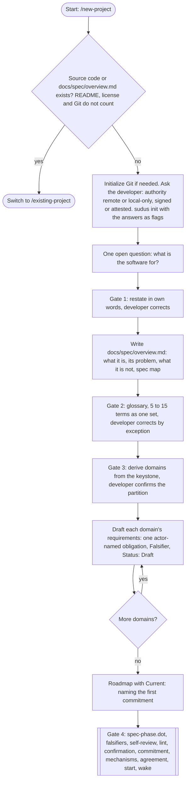
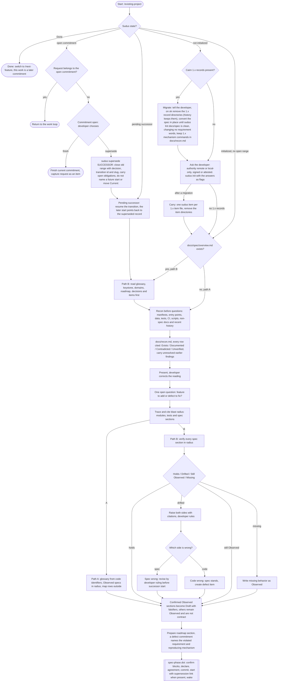
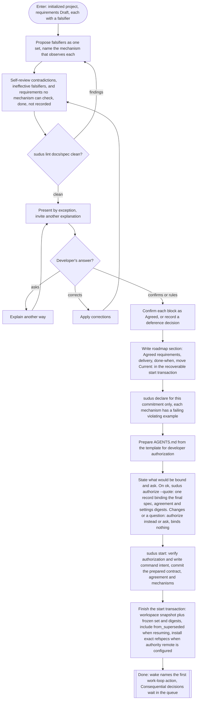
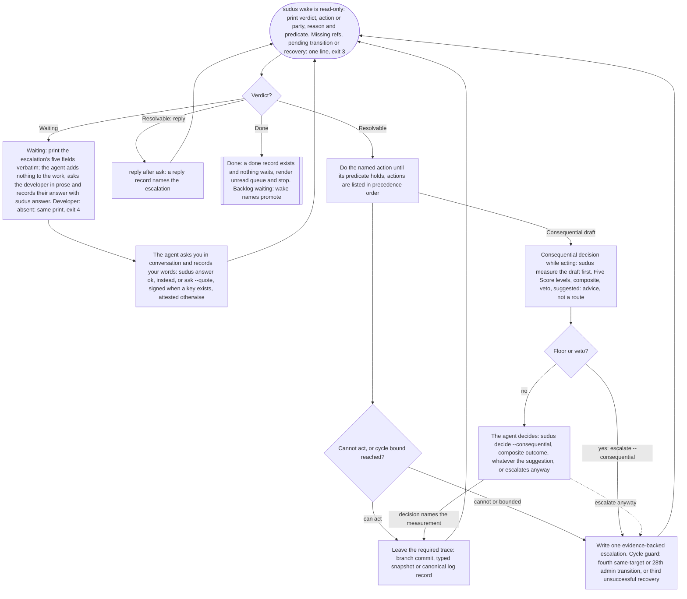
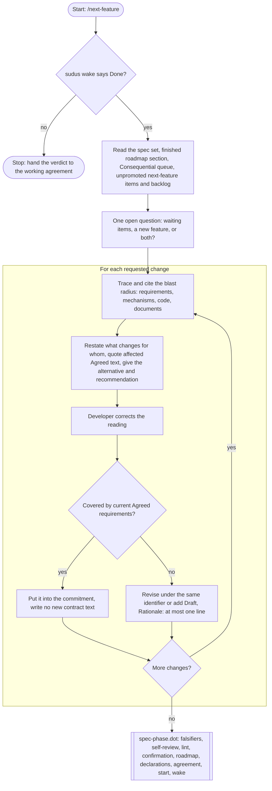
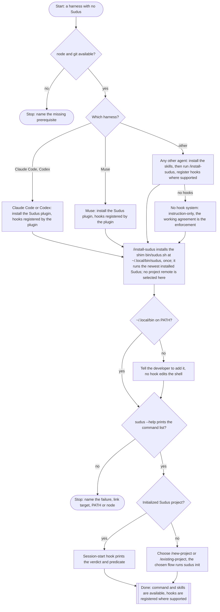

# Using Sudus: a human manual

You do not need to learn Sudus's record formats before you can use it. Your
job is to explain what you want, confirm that the written agreement means
what you think it means, and make the decisions that belong to you. The
agent can handle the files, the records, and the commands.

This manual explains what to expect at each stage, and gives the exact
command for when you want to act directly. Examples using `APP-001` or
`reject-empty-names` are illustrative: substitute the identifier or slug
Sudus actually prints. Run project commands from your project's repository
root.

Inside a repository every command runs at the top level whatever directory
you are in: the paths it prints and takes are repository-relative, except a
`--file` or `--signing-key` path, which is read from where you typed it.
Run `sudus --help` for the full list of commands. It works outside a
project and changes nothing.

Start with the [README](../README.md) for installation and an overview.
For a complete exercise you can run yourself, use the
[worked example](walkthrough.md). This manual is also the complete
reference: every command Sudus ships and every kind of record it writes
are listed near the end.

## Contents

- [Start with a clear goal](#start-with-a-clear-goal)
- [Agree on behavior you can recognize](#agree-on-behavior-you-can-recognize)
- [Let the agent work, and know when it needs you](#let-the-agent-work-and-know-when-it-needs-you)
- [The action lease](#the-action-lease)
- [Answer a decision without guessing](#answer-a-decision-without-guessing)
- [Decisions that did not stop the work](#decisions-that-did-not-stop-the-work)
- [Understand checks and their results](#understand-checks-and-their-results)
- [Review, the adversary, and Done](#review-the-adversary-and-done)
- [Scope: work Sudus did not expect](#scope-work-sudus-did-not-expect)
- [The evaluator: the agent's gut check](#the-evaluator-the-agents-gut-check)
- [Settings](#settings)
- [Turn on the TypeSafe evaluator](#turn-on-the-typesafe-evaluator)
- [Sending the records with the code](#sending-the-records-with-the-code)
- [Moving a project from Cairn](#moving-a-project-from-cairn)
- [Get unstuck](#get-unstuck)
- [Command reference](#command-reference)
- [Record reference](#record-reference)
- [Installation details](#installation-details)
- [Where these explanations come from](#where-these-explanations-come-from)

## Start with a clear goal

Describe an outcome, not a list of implementation steps. For example:

> People keep losing unfinished drafts when they close the app. I want them
> to be able to reopen a draft and continue writing.

For a new project, open the `new-project` skill by name. For existing
software, open `existing-project`. For a project already under Sudus whose
loop reports Done, open `next-feature`, which starts from the agreed
specification instead of reading the whole codebase again. The
existing-project skill instructs the agent to inspect the code first and
cite what it finds, in `docs/recon.md`. A description of what the code
currently does is marked **Observed**. It becomes an agreement about what
the code should do only after you confirm it.

Each of these skills runs `sudus init` the first time your project needs
it. Before that the agent asks you two things in conversation: whether
Sudus's durable records should travel to a Git remote (naming one, or
explicit local-only operation), and whether to verify your decisions with
a signing key or record them as attested, in your own words. You answer
once per project, not once per commitment, and you never type a command.

Expect the agent to propose the first **commitment**: one selected piece of
work with a defined result. A commitment is not a Git commit or a promise
about how long the work will take. It names what belongs in the current
task, and at most one commitment is open at a time. You can ask:

> Explain what this commitment includes, what it leaves out, and what I
> will be able to do when it is finished.

The agent records ideas outside that task as items. An item already covered
by the agreed specification is a backlog item; at Done the agent may
promote one by a recorded decision that waits for your review. An item that
would change the agreement is a next-feature item, and waits for you to
open the next feature specification. A defect against the current
commitment's own requirement is neither: it is worked now, because the
agreement already forbids it.

This is the new-project skill: from an empty directory to an Agreed first
commitment.



The Graphviz source is docs/diagrams/new-project.dot.

This is the existing-project skill: from an unspecified or drifted
codebase, or a pending supersession, to one prepared commitment.



The Graphviz source is docs/diagrams/existing-project.dot.

## Agree on behavior you can recognize

A useful requirement describes an observable result. "Make draft saving
robust" leaves too much room for interpretation. "A saved draft can be
reopened with the same text" gives you something you can examine.

Sudus uses two terms you will see often:

| Term | Meaning | Example |
|---|---|---|
| Falsifier | An observation that would show the requirement is not met. | Reopening a saved draft loses part of its text. |
| Mechanism | The declared command that checks the requirement. | A test that saves a draft, reopens it, and compares the text. |

Before agreeing, ask whether the failure example would catch the mistake
you care about. A build succeeding does not, on its own, show that drafts
survive closing the app.

A requirement is one block in a file under `docs/spec/`:

```text
[APP-001] The validator MUST reject an empty name.
Falsifier: The validator accepts an empty string.
Mechanism: names
Status: Draft
```

The identifier's prefix (`APP` above) is fixed by that file's `Prefix:`
header line, at the top of the file. `Status:` is one of `Draft`,
`Observed`, `Agreed <date>`, or `Retired <date>`. Only your confirmation,
directly or through a decision that quotes your ruling, moves a block to
`Agreed <date>`. Only Agreed blocks are checked, and a commitment may name
only Agreed requirements. A `Rationale:` line, at most one, may sit between
`Falsifier:` and `Status:`.

You do not have to correct every item yourself. The agent should present
related requirements and falsifiers together so you can correct the wrong
ones by exception. You do need to confirm the set; silence is not
confirmation. If anything is unclear:

> Explain what each option would change for me, before I decide.

### When the software requires a host path

Most requirements should name repository-relative paths, such as
`src/server.rs`. Some products also depend on a particular host binary or
configuration location outside the repository. Declare those in the
affected spec file's header, before its first requirement:

```text
Host paths: /usr/bin/bwrap, ~/.widget/config.toml
```

The list applies only to that file. Sudus reads this field; it never scans
requirement text for paths, and never copies a host path's target into a
snapshot or a model request.

The spec-phase diagram is the tail that new-project, existing-project and
next-feature all share, from drafted requirements to the first work-loop
action.



The Graphviz source is docs/diagrams/spec-phase.dot.

## Let the agent work, and know when it needs you

The agent's working agreement (`AGENTS.md`) tells it to run `sudus wake`,
do the action named until its predicate holds, then run it again. You can
also run it to see the current position:

```sh
sudus wake
```

Wake prints a verdict, one line naming the action or party, a reason, and
the predicate that completes the action:

```text
verdict: Resolvable
action: run APP-001
reason: no current receipt carries a result for APP-001
predicate: a current receipt carries a result for the requirement
```

| Verdict | What it means for you |
|---|---|
| `Resolvable` | A named action can be taken now. The reason and predicate say what and why. |
| `Waiting` | An escalation is unanswered. Wake prints its five fields verbatim; only you can close it. |
| `Done` | The open commitment meets every recorded condition, and the backlog holds nothing to promote. |

Outside a project, with the durable refs missing, during a pending
supersession, or with an interrupted transaction, `sudus wake` prints one
line naming the exact command or skill that continues, and exits 3; none
of these is a verdict.

You should not need to type "continue" after every `Resolvable` verdict.
Continuing is the agent's responsibility under the working agreement. Sudus
itself is a command-line tool; it does not keep an agent running or grant
permissions your agent application has withheld.

When returning in a new session, a useful prompt is:

> Read the working agreement and run Sudus's wake command. Explain the
> current goal and continue with the action it names.

Records exist only once committed, or, for a workspace snapshot, once
Sudus has captured the working tree's bytes into one. The agent should
commit the agreement, spec, mechanisms, and its own working code as it
goes; a fresh clone only sees what reached a commit or a Sudus record.

The work loop is what runs on every `sudus wake` cycle: it names one
action with its completion predicate, the agent does it, and it wakes
again.



Actions are attempted in this order:

| Action | done := |
|---|---|
| repair PATH | hand-written input parses; no unrelated byte changed |
| recover TRANSACTION | intent has a terminal domain or abort record; every store matches its result |
| reconcile ACTION | local action lease is gone; action finished or was abandoned |
| scope PATH | each durable breach is developer-kept or restored to its allowed base; later declaration never clears it; while the breach's own escalation is unanswered, wake says Waiting |
| supersede SLUG | every set requirement's Agreed text still has the digest its start froze, or a superseded record closes the commitment |
| fix ITEM | fix snapshot changes no protected contract; requirement has a current pass |
| record PATH | action lease covers the path, or it is clean |
| commit PATH | path is clean, or the action lease covers it; docs/decisions.jsonl is named here whenever it has uncommitted lines |
| declare REQ | mechanism definition names REQ; no prior undeclared delta was legalized |
| run REQ | current receipt matches input snapshot, definition, text and declared execution identity |
| implement REQ | current pass plus review metadata bound to current definition and frozen text, with fail receipt |
| escalate REQ | after three failing attempts, an escalation exists before a fourth; a run where a sibling requirement also failed is not an attempt |
| review mechanism REQ | review metadata binds definition and text to a fail receipt; product inputs unchanged |
| capture ITEM | outside record or escalation names it |
| review SLUG | current workspace snapshot; every fixed question answered for each target |
| report SLUG | isolated projection; current brief and report; all question and interface attempts present |
| resolve SLUG N | resolution or developer dispute names N on its exact source record |
| accept SLUG | current acceptance examines cumulative delta and every submitted resolution; it may add findings |
| build DECISION | realized line names base and result snapshots; actual delta passes protected-category check |
| done SLUG | Done rule holds; sudus done writes the final record |
| promote | one backlog item, decision, roadmap move and successor start are one transaction |

The Graphviz source is docs/diagrams/work-loop.dot.

## The action lease

Before changing a file a mechanism declares as its input, the agent claims
it:

```sh
sudus begin implement APP-001
```

This prints a lease sha and creates a local, unpushed ref
(`refs/sudus/in-progress`) naming the action, its target, and the
workspace at that moment. `sudus begin implement APP-001 --touch
src/new-file.mjs` also declares a new file as an input for the life of the
lease, so writing to it is not an undeclared change. After committing the
work:

```sh
sudus end --lease <the-sha-begin-printed>
```

Passing `--lease` means a stale `end` from a different, dead session can
never close the lease a live session is using. `sudus end --abandon`
releases the lease without claiming any touched path as a real change,
for when the attempt did not pan out.

The lease is local to your clone; it is never pushed and does not
coordinate two clones working at once. Two clones meet at the authority
remote: `sudus push` refuses a non-fast-forward or losing race there,
stopping the later writer before it publishes.

## Answer a decision without guessing

An **escalation** is a decision the agent cannot settle within its
authority or available information. `sudus wake` prints it in full so your
answer survives the current conversation, whatever happens to the chat:

```text
verdict: Waiting
party: developer
reason: three attempts at APP-004 without a pass
question: Should a name containing only spaces be rejected?
recommendation: Reject it.
because: It would look empty to the person reading the name.
if wrong: A caller relying on spaces as a name would need to change.
instead: Keep accepting spaces and reject only the empty string.
predicate: an answer record names the escalation with ok or instead
```

If those consequences are unclear, ask. You are not expected to approve
something because the agent used confident language.

### Your three answer forms

You answer in conversation, in your own words. The agent puts the five
fields to you in plain prose: the problem, then what `ok` accepts (the
recommendation), what `instead` means (the cost if the recommendation is
wrong, and the alternative) and what `ask` is for (you do not understand,
or want to discuss it). It ends with `ok | instead | ask`, waits, and then
records what you said.
Assume Sudus named the escalation `app-002`:

| You say | The agent records | What it authorizes |
|---|---|---|
| "Ok, reject it." | `sudus answer app-002 ok --quote "Ok, reject it."` | Proceed on the recommendation, within the agreed scope. |
| "Keep drafts on this device only." | `sudus answer app-002 instead --quote "Keep drafts on this device only."` | Use your stated direction; update the agreement if the scope changes. |
| "What would syncing change for users?" | `sudus answer app-002 ask --quote "What would syncing change for users?"` | Explain the choice. It does not authorize implementation. |

An `ask` answer keeps the question open. The agent records its explanation
with `sudus reply app-002 "<explanation>"`, and the decision comes back to
you. You can ask again; only `ok` or `instead` closes it. You never type a
command: the agent asks, you answer, the agent records.

`sudus answer`, `sudus decisions --read` and `sudus authorize` carry
evidence of your decision. With a signing key configured, the record must
carry a valid signature; the command prints the exact bytes to sign and the
nonce to repeat when it needs one. Without a signing key, the project uses
attested mode: the record holds your words as the agent quoted them, the
name of the harness the conversation ran in, and your Git author identity.
That is evidence, not cryptographic proof it was you, and Sudus says so
wherever it reports the decision.

## Decisions that did not stop the work

Sudus has two levels of decision, both left to the agent's judgment about
which applies:

| Level | What happens |
|---|---|
| Consequential | A costly-to-reverse or boundary-crossing choice is recorded with `sudus decide --consequential` and queued for your review; the agent continues. |
| Blocking | The agent stops and raises an escalation with `sudus escalate`. |

The working agreement may also describe Routine and Judged guidance for the
agent's own use; neither leaves a record.

Read the queue:

```sh
sudus decisions
sudus decisions --read <decision-id> --quote "<your words>"
```

The first command renders every line in `docs/decisions.jsonl`. Reading a
decision carries your evidence, the same as answering an escalation: after
the agent has explained a decision and you have said you read it, the agent
runs `--read` with your words quoted, appending a `read` line rather than
deleting anything. You can ask:

> Show me the queued decisions. For each, explain what was chosen, what it
> changes, and what would make us reconsider it.

A promotion from the backlog is one of these decisions. Read it for the
requirement and falsifier the agent wrote; if you disagree, tell the agent
and it can supersede the commitment before continuing.

When a Consequential decision requires building something, the agent
builds it, commits, and records:

```sh
sudus realize <decision-id> --subject "what was actually built"
```

`build <decision>` stays the wake action until that realized line names
the decision's starting and resulting workspace snapshots, and the
realization check, comparing the two, passes. A change touching a `data`
path, frozen Agreed text, the working agreement, or protected settings
always stops and escalates, whatever the decision said it intended.

If a resolution to a finding is rejected twice, or you want to contest one
directly, that becomes an escalation of its own:

```sh
sudus dispute --commitment reject-empty-names --record <finding-record-sha> --n 2 \
  --question '...' --recommendation '...' --because '...' --if-wrong '...' --instead '...'
```

This is next-feature: it starts from Done and specifies the next
commitment.



The Graphviz source is docs/diagrams/next-feature.dot.

## Understand checks and their results

A **mechanism** is the declared command that checks one or more
requirements. The agent writes its definition as JSON and declares it:

```sh
sudus declare names --file mechanism-names.json
```

```json
{
  "command": "node tests/names.mjs",
  "inputs": ["src/names.mjs", "tests/names.mjs"],
  "requirements": ["APP-001"],
  "results": "per-requirement"
}
```

`inputs` are literal paths, never globs; a directory covers everything
Git tracks beneath it. `documents` (optional) is a subset of `inputs` whose
changes cost a check but never stale a review. A `documents` path may not
also sit below a `source` root in settings. With `"results":
"per-requirement"`, the command must print one line per requirement it
speaks for, `sudus: APP-001: pass` or `sudus: APP-001: fail`; an omitted
requirement stays `unverified`. Without that field, the command's exit
code decides every declared requirement's result: zero is pass, nonzero or
a signal is fail.

Run the check:

```sh
sudus check APP-001
```

This selects the one mechanism declaring APP-001 (two or more is refused;
name one explicitly by fixing the declarations first), runs it against an
input snapshot of exactly its declared inputs, and appends a receipt
record. `sudus show <receipt-sha>` prints it, including the observed exit
code and a digest of the captured output, which lives at
`.sudus/output/<digest>`, ignored by Git.

| Result | What it establishes |
|---|---|
| `pass` | The command reported a pass for this requirement, under its declared reporting rule. |
| `fail` | The command reported a failure. Inspect the output to understand why. |
| `unverified` | This run established no verdict for the requirement. It cannot satisfy Done, and it does not count as a failed attempt. |

A receipt is **current** only while its input snapshot tree, mechanism
definition digest, the requirement's exact text digest, the observed
declared execution identity, and the record schema all still match. Any of
these changing makes wake name `run <REQ>` again; a kernel upgrade, by
itself, does not.

Before a mechanism's evidence counts at all, the agent shows it fail on a
violating example and binds that failure:

```sh
sudus review mechanism APP-001 <the-fail-receipt-sha>
```

This binds the mechanism's review metadata to its current definition
digest and the requirement's current text digest, with that fail receipt
as the demonstration that the check actually catches the violation. A
revised requirement, or a changed mechanism definition, unbinds this and
`review mechanism REQ` becomes the next wake action before another check
counts.

## Review, the adversary, and Done

Before Done, the builder answers six fixed questions and lists findings, in
a JSON file the agent writes and records:

```sh
sudus review reject-empty-names --file review.json
```

```json
{
  "examined": ["the empty-name failure before the fix and the pass after it"],
  "answers": [
    { "question": "Q1", "target": "names", "status": "observed", "text": "..." },
    { "question": "Q2", "target": "names", "status": "observed", "text": "..." },
    { "question": "Q3", "target": "APP-001", "status": "observed", "text": "..." },
    { "question": "Q4", "target": "APP-001", "status": "observed", "text": "..." },
    { "question": "Q5", "target": "reject-empty-names", "status": "observed", "text": "..." },
    { "question": "Q6", "target": "reject-empty-names", "status": "not-checked", "text": "" }
  ],
  "findings": []
}
```

| # | Per | Question |
|---|---|---|
| Q1 | mechanism | Which violating example failed the check, which fail receipt records it, and what did the check print? |
| Q2 | mechanism | Why was that failure the stated violation, not a setup error? |
| Q3 | implemented requirement | Why is its falsifier now unreachable? |
| Q4 | implemented requirement | What else did the change touch that no check covers? |
| Q5 | commitment | What could still be wrong while every check passes? |
| Q6 | commitment | What was not tested? |

`answers` needs exactly one entry for every `(question, target)` pair this
commitment has: Q1 and Q2 once for each declared mechanism, Q3 and Q4 once
for each requirement the commitment implements, Q5 and Q6 once for the
commitment itself. Each entry's `status` is `observed`, with `text` naming
a command, path, or output, or `not-checked`, with empty text. `findings`
is a list of `{"n": 1, "text": "..."}`, numbered from 1, or `[]` for none.
Sudus checks this shape, never truth: it cannot tell a careful review from
an empty claim.

Once the review exists, wake names `report reject-empty-names`. First:

```sh
sudus brief reject-empty-names
```

This writes a brief record and a materialized **adversary projection**: a
copy of the reviewed workspace with every `network_exclude` path and
built-in credential pattern (`.env`, `.env.*`, private-key files,
conventional SSH key names) removed, and no `.git` directory. It prints
the brief file's path, the projection directory, and the exact instruction
for starting the adversary: which harness, which model and transport (or
`any`, when settings do not pin one), and to use the brief file as that
session's entire prompt. The agent starts that adversary with none of the
builder's conversation context and waits. For each mechanism, the adversary
tries to make it pass without the behavior, fail for a setup reason instead
of the real one, and find an input it reads but the declaration omits. For
each implemented requirement, it tries to reach the falsifier anyway. For
every changed interface, it gives a caller-level attempt whether or not the
builder raised it. Its findings, in a JSON file shaped like the
review's but with `attempts` (one `{"question", "target", "text"}` per
required pair) in place of `answers`, plus `interface_attempts` (one
`{"path", "text"}` per changed interface path) and the `model` and
`projection_digest` the brief printed, are recorded:

```sh
sudus report reject-empty-names --file report.json
```

This refuses a report whose workspace differs from the reviewed snapshot,
whose brief is stale, whose model, transport, or projection digest does
not match the brief's launch instruction, or which leaves a required
question or interface attempt missing. There is one report per commitment.

Every finding, from the review or the report, is answered:

```sh
sudus resolve reject-empty-names 1 "fixed by validating with String.prototype.trim first" --source <sha of the review or report>
```

or disputed with `sudus escalate` when you and the agent disagree that it
is a real finding. After fixes, give the same adversary session the
report, every resolution since it, and the cumulative delta; it judges
each submitted resolution and may raise new findings anywhere in that
delta, in a JSON file:

```sh
sudus accept reject-empty-names --file acceptance.json
```

```json
{
  "resolutions": [
    { "sha": "<resolution sha>", "verdict": "accepted", "reason": "the fix matches the finding" }
  ],
  "findings": []
}
```

A rejected verdict needs a `reason`. A resolution rejected twice for the
same finding raises its own escalation automatically.

Done requires the latest acceptance to examine the final workspace
snapshot with every resolution accepted and every finding, anywhere,
resolved or disputed by you. A report with no findings and no change after
it needs no acceptance: there is nothing to examine. When it holds:

```sh
sudus done reject-empty-names
```

Ask for a completion report that answers:

> What can I do now? What changed? What was tested? What did the review
> and the report examine? Is anything important still outside this
> agreement?

Try the behavior yourself where that gives you useful information. Sudus
cannot tell a careful review from an empty claim, or a thoughtful
adversary from a rubber stamp; the shape of the record, the model's
identity, and the projection boundary are the evidence it can show you.

## Scope: work Sudus did not expect

Before any state-changing command, Sudus compares the working tree with the
newest allowed workspace snapshot. An undeclared, non-`outside` changed
path becomes a durable **scope breach** record, and wake names `scope
<path>` before anything else. A path touched under an active lease is
already declared, so ordinary implementation work under `sudus begin` is
never a breach.

Restore the path to its recorded base and dispose of the breach:

```sh
sudus scope <breach-sha> restore
```

Or, when the work is correct and belongs, ask you to keep it explicitly
with `sudus escalate --concern breach:<breach-sha> ...`, record your ok,
then:

```sh
sudus scope <breach-sha> keep
```

A later `sudus declare` cannot retroactively clear an existing breach; it
only legalizes future changes.

## The evaluator: the agent's gut check

At a Consequential decision, the agent drafts its choice, then measures it
before deciding: `sudus measure` scores five things about the draft -- how
much evidence backs it, how far the recommended option reaches, how well it
fits the cited requirement's contract, how much new surface it adds, and how
ambiguous the question is -- each 0 to 4, with a confidence. Reach, contract
and surface are judged for the recommended option against the draft's other
options, which the state carries alongside it.
Code, not the model, turns those five numbers into a composite and a
`suggested: agent | developer` reading; the suggestion is advice, not a
route. The agent reads it and decides, except in two cases code always
catches on its own: a draft that would change an Agreed requirement's text
or falsifier, the working agreement, or data that cannot be regenerated
(the floor), or a draft the measurement itself flags as too consequential
(the veto: a wide-reaching, contract-changing, or new-surface option).
Either one sends the draft to you, and `sudus decide --consequential`
refuses it. In every other case the agent may still choose
`sudus escalate --consequential` past a `suggested: agent` reading, at its
own judgment.

Turning on `typesafeai.enabled` in `.sudus/settings.json` picks the
measurement's source: `jev` (`bin/typesafeai.mjs`, reading
`TYPESAFEAI_API_KEY` from the environment and never storing it) when
enabled, or, when it is not, the harness's own configured review model,
started the same way `sudus brief` starts the adversary -- with none of the
agent's own conversation context. Either way, every Consequential draft is
measured; there is no off switch and no shadow mode, because a shadow
default that never let a draft reach the agent was tried and measured at
zero agent routing out of twelve expected cases
(`.superpowers/bench/results.md`).

```sh
sudus calibrate
```

reports how many developer-labelled, `suggested: agent` measurements exist
and how many you later called wrong. It passes when the one-sided 95% upper
bound on that false-downgrade rate stays under the fixed 5% cap.
It tunes `weights`, `agent_ceiling` and `confidence_floors` in
`.sudus/settings.json`; it does not gate whether the agent may decide --
that gate was tried too, and it produced the same zero-routing result. A
project with `developer: absent` (an autonomous benchmark configuration)
has no one to answer an escalation the floor raises; wake prints it
exactly as it always prints Waiting and exits 4 instead of sitting there.

The benchmark under `tests/bench` (24 drafts over one small ledger project;
`SUDUS_BENCH=1 npm run bench` with the key in the environment) scores 22 of
24 against the expected route. The ceiling and weights were chosen on those
same drafts, so the figure is in-sample; rerun it after any change to the
criteria text, the state or the settings defaults.

## Settings

`sudus init` writes `.sudus/settings.json`. Every key is listed here with
its default. The file is protected: after you change it, tell the agent.
It states the change and, on your ok, runs
`sudus authorize --quote "<your words>"` so the new settings digest is
bound to the loop. Until then wake names the repair.

| Key | Default | Meaning |
|---|---|---|
| `schema` | current | The settings schema version; do not edit. |
| `authority_remote` | the remote `init` confirmed, or `null` | The one remote the records may be pushed to (`sudus push`). |
| `outside`, `source`, `interfaces`, `data` | `[]` | Path globs that classify the tree: outside the agreement, source, public interfaces, data that cannot be regenerated. The floor and the scope check read them. |
| `network_exclude` | `[]` | Path globs whose content never reaches any model, on top of the built-in credential patterns. |
| `signing_key` | the key `init` chose, or `null` | The key that signs developer answers and authorizations; `null` means attested mode: your words, quoted by the agent, with the harness name and your Git author. |
| `attribution` | `"forbidden"` | Whether commit messages may carry AI attribution; the release script refuses when forbidden and any is found. |
| `developer` | `"present"` | `"absent"` for an autonomous run: any unanswered escalation prints as Waiting and wake exits 4 instead of waiting for an answer no one can give. |
| `harness` | `{}` | Per-harness review settings: `harness.<name>.adversary_model` (string or `null`) and `adversary_transport` (`"local"` or `"remote"`), used by `sudus brief` and by the review source of the evaluator. |
| `typesafeai.enabled` | `false` | `true` sends each Consequential measurement to TypeSafe's jev model; `false` uses your harness's review model through `sudus measure --brief`. |
| `typesafeai.model` | `null` | The versioned model id, required when enabled: `"jev-1.13.0"` at the time of writing. An alias such as `"jev"` is refused. |
| `typesafeai.weights` | 0.2 each | The five dimension weights (`evidence`, `reach`, `contract`, `surface`, `ambiguity`); they must sum to 1. |
| `typesafeai.agent_ceiling` | `0.35` | The composite at or under which the suggestion is `agent`; above it, `developer`. |
| `typesafeai.confidence_floors` | 0 each | Per-dimension minimum confidence for an `agent` suggestion. |
| `typesafeai.min_calibration_agent_predictions` | `60` | Labelled `suggested: agent` cases `sudus calibrate` needs before it reports a pass or fail. |
| `typesafeai.request_cap_bytes` | `48000` | The largest request the evaluator sends; a draft over it is recorded `unavailable oversize` and goes to you. |

The defaults for the ceiling, weights and floors are the ones the in-tree
benchmark (`tests/bench`) scored 22 of 24 with. Change them and rerun it.

### Turn on the TypeSafe evaluator

By default the measurement comes from your harness's own review model and
needs no account. To use TypeSafe's jev model instead:

1. Get an API key from https://typesafe.ai and export it in the shell that
   runs your agent: `export TYPESAFEAI_API_KEY=...`. Sudus reads it from
   the environment only; it never writes it to a file, a record or a log,
   and the key never appears in an error message.
2. In `.sudus/settings.json` set `"typesafeai": { "enabled": true, "model": "jev-1.13.0", ... }`,
   leaving the other keys at their defaults.
3. Tell the agent; on your ok it runs `sudus authorize --quote "<your words>"` to bind the changed settings.
4. At the next Consequential decision the agent runs `sudus measure ...` and
   the call goes to `https://api.typesafe.ai/v1/systemone` with the closed
   state described above; the measurement record holds the five levels, the
   composite, any veto and the suggestion. A transport failure, a rate limit
   after the built-in retries, or an invalid answer is recorded as
   `unavailable <class>` and the draft goes to you; nothing is retried
   silently.

Without a key, `sudus measure --brief` prints a brief and a launch block;
a fresh session of your harness's review model answers it into a JSON file
and `sudus measure <slug> --file <path>` completes the measurement through
the same parser and the same composite. The two sources answer the same
five questions over the same state; on the benchmark they agreed on every
draft compared.

To check the evaluator against the 24-scenario benchmark on your own key:
`SUDUS_BENCH=1 npm run bench` from the checkout, one scenario at a time.

## Sending the records with the code

Only `refs/sudus/log` and `refs/sudus/snapshots` travel with the code. Set
`authority_remote` during `sudus init` (or change it with a new
`sudus authorize`) to the one remote these should reach; `null` means
explicit local-only operation. Push everything together:

```sh
sudus push
```

This pushes the branch and both durable refs atomically where the remote
supports it, or snapshots first, log second, and branch last otherwise,
stopping the sequence on any failure. Never push `refs/sudus/*` with plain
`git push`; a bypassing push can create a mismatch wake will need to
repair. After a fetch, `sudus wake` validates every cross-reference and
names the exact fetch or push that repairs a gap; it never guesses. A
clone missing the durable refs is told the exact `git fetch` to run, or,
with no remote configured, to run `sudus init`.

## Moving a project from Cairn

Sudus was named Cairn until 3.0.0, and a project that started under that
name keeps its records under `.cairn/` and `refs/cairn/*`. Every command
reads and writes them there; a mechanism that prints `cairn: REQ-001:
pass` still passes; the `cairn` command still runs. The only sign is one
line after the wake verdict:

```
layout: .cairn (the former name); sudus migrate moves it to .sudus between commitments
```

The move is one command, and it is the agent's to run, not yours:

```sh
sudus migrate
```

It runs only between commitments (before the first `sudus start`, or
after Done), because the next start's snapshot is the next allowed base
and the work of the next spec phase is compared against the last done
snapshot only for kernel-managed paths. That snapshot still names the
`.cairn/` mechanism files; their move is the kernel's own and is never a
scope breach. It refuses while a commitment, an action lease or a transaction is
open, and while anything under `.cairn/` or `.gitignore` is changed and
uncommitted, so that the move is the whole of its commit. It renames the
three refs, moves the directory with `git mv`, rewrites the `.cairn`
lines of `.gitignore`, and commits `sudus: migrate from the .cairn layout
to .sudus`. The records already on the log keep their original subject
and trailers; new ones are written as `sudus:` records, and the log reads
as one. `.cairn/**` stays a reserved path afterwards, so a stray file
there is never plain work.

With an authority remote, `sudus push` publishes the moved refs, and
migrate gives the remote the new fetch and push refspecs. Another clone
that pulls the move sees `.sudus/` on its branch but still holds
`refs/cairn/*`; wake names `sudus migrate` there. Migrate asks the remote
first: when it already holds the moved refs, migrate names the fetch that
brings them, since renaming the clone's own stale refs would make an old
log current; when it does not, migrate moves the refs alone. The remote's
old `refs/cairn/*` are left behind unused.

## Get unstuck

Read the reason and predicate printed below the verdict; they are more
specific than the action word alone.

| Action wake names | What it means, and what to do |
|---|---|
| `repair PATH` | A hand-written file (spec or settings) does not read under its grammar. Fix only what is broken; `sudus lint docs/spec` shows spec problems. |
| `recover TRANSACTION` | A multi-record write (`start`, `promote`, `supersede`, `authorize`) was interrupted. Run `sudus recover <transaction>`. |
| `reconcile ACTION` | A local action lease exists with no matching finished work, usually left by a session that ended. Finish the action and `sudus end`, or `sudus end --abandon`; a dead session's lease needs no `--lease`. |
| `scope PATH` | An undeclared change was observed. Restore it (`sudus scope PATH restore`) or ask to keep it (`sudus escalate`, then `sudus scope PATH keep`); the breach sha wake's reason names works too. |
| `supersede SLUG` | The Agreed text of a requirement in the open commitment was revised under it, and no check or review can bind to both the frozen and the current text. Restore the text the start froze, or ask the developer and `sudus supersede <successor> --quote "..."` so the successor freezes the revised text. |
| `fix ITEM` | A recorded defect is still open: this commitment's own while it is open, any defect between commitments. Write a failing test, fix it, commit, check, then `sudus fix ITEM` (the slug wake prints, or the sha). |
| `record PATH` / `commit PATH` | A declared input has uncommitted changes with no covering lease. Lease the action that changes it with `sudus begin <action> <target>` (`record` is not a begin action), then commit; or revert it. An untracked build artifact under a declared input is gitignored instead. |
| `declare REQ` | No mechanism speaks for this requirement yet. `sudus declare` one. |
| `run REQ` | A check is due: `sudus check REQ`. |
| `implement REQ` | The latest receipt is not a current pass. Read it and the captured output, then fix the code under a lease. |
| `escalate REQ` | Three distinct failing attempts with no pass since. `sudus escalate` before a fourth. |
| `review mechanism REQ` | The requirement or the mechanism definition changed. Compare the check against the new text, then `sudus review mechanism REQ`; it takes the latest fail receipt, which wake's reason names, unless you pass another. |
| `capture ITEM` | An idea outside this commitment needs a disposition: `sudus outside ITEM --reason "..."` (slug or sha), or escalate if it actually belongs. |
| `review SLUG` | Write and record the review, answering all six questions. |
| `report SLUG` | `sudus brief`, start an adversary with none of your context, then `sudus report --file`. |
| `resolve SLUG N` | An open finding needs a fix or a dispute. |
| `accept SLUG` | Give the adversary the report, the resolutions, and the delta; `sudus accept --file`. |
| `build DECISION` | Build what the decision says, commit, then `sudus realize`. |
| `done SLUG` | Every condition holds: `sudus done SLUG`. |
| `promote` | No commitment is open and the backlog holds an item. Choose one; `sudus promote ITEM` (slug or sha). It refuses while any defect is unfixed, and while `Current:` names a section that is neither the finished commitment nor the item. |
| `reply SLUG` | You asked a question with `ask`; the agent owes an explanation: `sudus reply SLUG "..."`. |
| `Waiting` | An escalation needs your answer. With `developer: absent` no one can answer any escalation; wake exits 4 instead of sitting there. |

## Command reference

Run `sudus --help` for the authoritative, exact list; this table explains
each one's purpose. `<sha>` is any record's commit SHA; `sudus show <sha>`
prints one with its references resolved.

| Command | Purpose |
|---|---|
| `show <sha>` | Print one record, with the records and snapshots it references described. |
| `show items` | List every item record: sha, kind, slug, source, body, and whether it was promoted or fixed. |
| `lint docs/spec` | Check the specification's grammar: identifiers, falsifiers, mechanisms, statuses, and the spec map. |
| `init --remote <name>\|--local-only --signing-key <path>\|--attested [--adopt <digest>] --quote <words>` | Create or adopt `.sudus/settings.json` and the two durable refs, with the developer's answers as flags; the command asks nothing itself. |
| `migrate` | Move a project from the former layout (`.cairn/`, `refs/cairn/*`) to `.sudus/` and `refs/sudus/*`, once, between commitments; nothing to do on a Sudus project. |
| `authorize [ok\|instead\|ask] --quote <words>` | On ok, bind the current digests of the specification, the working agreement, and settings in one record carrying the developer's evidence; `instead` or `ask` writes a direction record with the developer's words and binds nothing. |
| `decisions [--read <id> --quote <words>]` | Print the ADR file, or mark one decision read, quoting the developer. |
| `recover <transaction>` | Finish or safely abandon an interrupted multi-record write. |
| `begin <action> <target> [--touch <path>]...` | Claim the local action lease before changing a declared input; `--touch` provisionally declares a new path. |
| `end [--abandon] [--lease <sha>]` | Release the action lease; `--lease` refuses a mismatched sha; `--abandon` releases without claiming touched paths. |
| `check <REQ>` | Run the one mechanism declaring `REQ` and record a receipt. |
| `declare <name> --file <path>` | Read a mechanism definition as JSON and write it under that name. |
| `scope <breach-sha or path> keep\|restore` | Dispose of a scope breach: keep the captured work (after a developer `ok`) or restore the path to its allowed base. A path resolves to its one open breach. |
| `start <slug>` | Open the commitment named in the roadmap's `Current:` line, after verifying the authorization; commits the prepared spec, agreement, and mechanisms. |
| `done <slug>` | Close the open commitment. Refuses until wake names `done`, and says what wake names instead (an unfixed defect, an unresolved finding, an unanswered escalation). |
| `supersede <successor> --quote <text>` | Close the open commitment without Done, quoting the developer's ruling, and name the intended successor slug. |
| `promote <item-sha>` | After Done, with the backlog holding this item, open it as the next commitment. |
| `item --backlog\|--defect --slug <s> --from <REQ> --body <text>` | Capture an idea or a defect against an Agreed requirement. |
| `item --next-feature --slug <s> --from <REQ or contract> --body <text>` | Capture a change to Agreed text or a contract path; it waits for the developer. |
| `outside <item-sha> --reason <text>` | Record that a captured item is not this commitment's work. |
| `fix <item-sha>` | Record that a defect item is fixed, naming the workspace snapshot. Runs under the open commitment, or under the last closed one when it raised the defect against its own requirement. |
| `decide --consequential --title <t> --rests-on <REQ,...> --wrong-if <t> --body <t>` | Record a spec-phase deference ruling, before any commitment is open. |
| `decide --consequential --commitment <s> --concern <token>... --question <q> --recommendation <r> --because <b> --if-wrong <w> --instead <i> [--option <t>...] [--path <p>...] [--decision <id>...]` | Record a measured work-loop Consequential decision; the agent continues. Refused without a current `composite`-outcome measurement: `sudus: no measurement for this exact draft; run sudus measure first` when the draft differs from the one measured, or a message naming the floor or veto that caught it. |
| `realize <decision-id> --subject <text>` | Record that a Consequential decision was built. |
| `escalate [--consequential] --commitment <s> --concern <token>... --question <q> --recommendation <r> --because <b> --if-wrong <w> --instead <i> [--option <t>...] [--path <p>...] [--decision <id>...]` | Raise a decision; without `--consequential`, a Blocking one (the agent stops). With `--consequential`, the Consequential draft's own measurement forced it here, or the agent chose to. |
| `calibrate` | Report how many labelled, suggested-agent measurements exist and how many were wrong, against the fixed bound; tunes the composite, never gates it. |
| `measure [--brief] [--harness <name>] --commitment <s> --concern <token>... --question <q> --recommendation <r> --because <b> --if-wrong <w> --instead <i> [--option <t>...] [--path <p>...] [--decision <id>...]` \| `measure <slug> --file <path>` | Take one measurement of a Consequential draft before `decide` or `escalate`; `--brief` prints a launch block for the review source, `--file` completes it. |
| `answer <slug> ok\|instead\|ask --quote <words> [--escalation <sha>]` | The developer's answer to an escalation, in their own words. |
| `reply <slug> <text> [--escalation <sha>]` | The agent's explanation after a developer `ask`. |
| `dispute --commitment <s> --record <sha> --n <n> --question <q> --recommendation <r> --because <b> --if-wrong <w> --instead <i>` | Escalate disagreement with a specific finding or its resolution. |
| `review <slug> --file <path>` | Record the builder's review. |
| `review mechanism <REQ> [<fail-receipt>]` | Bind a mechanism's review metadata to its current definition and the requirement's current text; the latest fail receipt for REQ when none is given. |
| `brief <slug> [--harness <name>]` | Write the adversary brief and projection for a reviewed commitment. |
| `report <slug> --file <path>` | Record the adversary's report. |
| `resolve <slug> <n> "<how>" [--source <sha>]` | Record a fix for finding `n` of a specific review, report, or acceptance record. |
| `accept <slug> --file <path>` | Record the adversary's verdict on the post-report delta. |
| `push` | Push the branch and both durable refs to the authority remote. |
| `wake` | Print the current verdict. Writes nothing. |
| `--help` | Print the command list. `sudus <command> --help` (or `-h`) prints that command's usage line and runs nothing. |
| `--version` | Print the version; the first thing to compare with this manual when behavior differs. |

## Record reference

Every durable fact is one of these record kinds, a commit on
`refs/sudus/log`, or a line in `docs/decisions.jsonl`. `sudus show <sha>`
prints any log record. This table names what each kind carries and where
Sudus reads it back; the full field list is in
[the specification](spec/sudus-v2.md#4-the-record-set).

| Kind | Carries | Read at |
|---|---|---|
| `init` | Settings digest, authority remote or local-only, developer-auth mode. | Every project command. |
| `authorization` | Spec, agreement, and settings digests; developer-auth evidence. | `start` and every protected write. |
| `direction` | `instead` or `ask` on an authorization, the developer's words, harness, Git author. | Nothing; the log keeps it. |
| `command-intent` / `command-abort` | A multi-record write's plan, or its verified rollback. | `wake` and `recover`, until finished. |
| `start` | Slug, roadmap workspace snapshot, the frozen requirement set with text digests. | Every wake; opens the range. |
| `receipt` | Mechanism and definition digest, input snapshot, per-requirement result and text digest, output digest. | Freshness and attempt counting. |
| `review` | Slug, workspace snapshot, the six answers, findings. | Brief, report, Done. |
| `brief` | Slug, review sha, projection and payload digests. | Report validation. |
| `report` | Slug, workspace snapshot, brief sha, model, attempts, findings. | Done and resolution. |
| `resolution` | Source record sha, finding number, workspace snapshot, explanation. | Acceptance and Done. |
| `acceptance` | Slug, report sha, workspace snapshot, accepted/rejected resolutions, new findings. | The next resolve, accept, and Done. |
| `escalation` | Slug, the five fields, concern reference. | Every wake, until answered. |
| `answer` | Escalation sha, `ok`/`instead`/`ask`, the developer's words, developer-auth evidence. | Wake, ADR, calibration. |
| `reply` | Escalation sha, text. | Wake, after `ask`. |
| `read` | Decision id, developer-auth evidence. | Queue and ADR. |
| `evaluation-intent` / `evaluation-call` / `measurement` | The evaluator's fixed request, the one attempted call, and the five scored dimensions, composite, veto and suggestion. | Escalation, decide, queue, calibration. |
| `calibration` | Policy digest, sample, false-downgrade count, bound, pass/fail. | Tuning `weights`, `agent_ceiling` and `confidence_floors`; never a gate. |
| `item` | Kind (backlog/next-feature/defect), slug, source, body. | Capture, Done, next feature. |
| `outside` | Item sha, reason. | Capture gate. |
| `promotion` | Item sha, decision id. | After Done. |
| `fix` | Item sha, workspace snapshot. | Done. |
| `scope-breach` / `scope` | Path, first-observed snapshot, allowed base, disposition. | Every wake, until disposed. |
| `done` | Slug, final workspace snapshot. | Closes the range. |
| `superseded` | Slug, old start sha, decision id, successor slug, carried records. | Closes the old range; the successor start. |
| ADR `decision` / `realized` / `superseded` / `answered` / `read` | One canonical JSON line each in `docs/decisions.jsonl`. | `sudus decisions`, wake, calibration. |

## Installation details

See the [README](../README.md#install) for the marketplace and checkout
install paths. In every path, the agent installs the shim `bin/sudus.sh`
at `$HOME/.local/bin/sudus`, once; the shim runs the newest installed
Sudus (`$SUDUS_ROOT` or `$CAIRN_ROOT` when set, else the newest Claude Code or
Codex plugin cache entry under either name or the checkout, by version), so
a plugin update never strands the command. The skill replaces only a symlink an earlier Sudus made or an
older copy of the shim, never another file; no hook writes it. Claude Code and
Codex read `hooks/hooks.json` (SessionStart, UserPromptSubmit, Stop);
Muse reads two entries (SessionStart, Stop) from
`.muse-plugin/plugin.json`. Every hook prints the current wake verdict, in
one line, at most, beyond that. No hook writes a file, commits, refuses a
stop, or counts anything; a harness without hooks relies entirely on the
working agreement in `AGENTS.md`.

`sudus --root DIR` does not exist in this version; run commands from your
project's repository root. There is no separate status command; `sudus
wake` is how you see the current position.

The following diagram shows the install process, from a harness with no
Sudus to the command, hooks and skills being available.



The Graphviz source is docs/diagrams/install.dot.

## Where these explanations come from

This manual describes the source in this checkout. The CLI enforces
record structure, freshness, and precedence; the skills and the working
agreement instruct the agent how to reason and when to stop.

| Behavior explained here | Implementation |
|---|---|
| Verdicts, actions, and precedence | `lib/wake.mjs` |
| The command table and `--help` | `lib/cli.mjs` |
| Requirement grammar and the spec lint | `lib/spec.mjs` |
| Settings validation | `lib/settings.mjs` |
| Mechanisms, receipts, and freshness | `lib/mechanisms.mjs`, `lib/check.mjs` |
| The action lease and crash recovery | `lib/lease.mjs`, `lib/tx.mjs` |
| Commitments, items, and the ADR | `lib/commitment.mjs`, `lib/adr.mjs` |
| Scope breaches | `lib/scope.mjs` |
| Escalations and answers | `lib/escalate.mjs` |
| Review, the brief, and the adversary | `lib/review.mjs` |
| The evaluator | `lib/evaluate.mjs`, `bin/typesafeai.mjs` |
| Pushing the durable refs | `lib/travel.mjs` |
| Starting a project and confirming behavior | `skills/new-project/SKILL.md`, `skills/existing-project/SKILL.md`, `skills/next-feature/SKILL.md` |
| The agent's per-turn and per-project responsibilities | `skills/new-project/templates/AGENTS.md` |

Tests under `tests/` exercise each module named above; run `npm test` in
this checkout.
